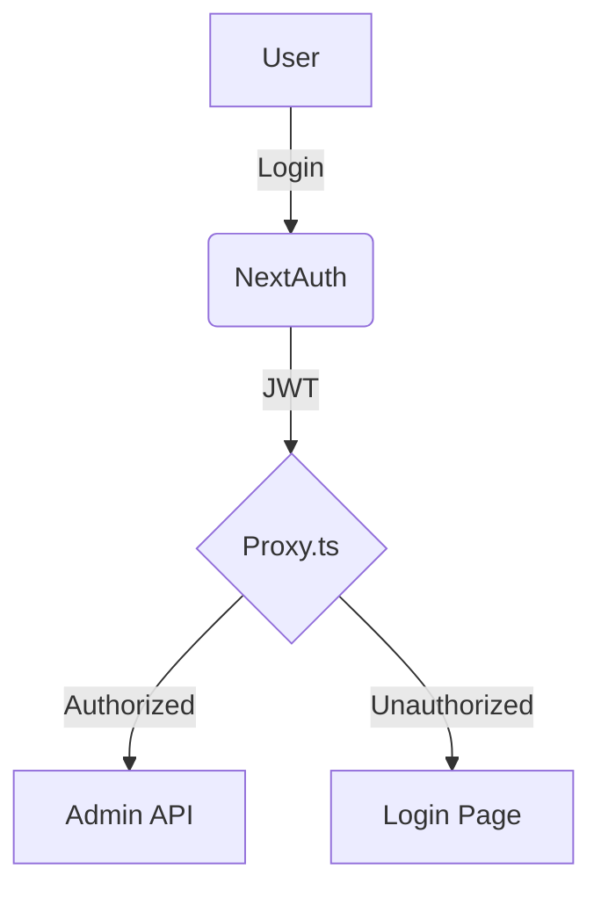

# Best Practices for Documentation Writing

This guide outlines proven patterns and anti-patterns for writing technical documentation in Project SENTINEL, ensuring clarity, accuracy, and maintainability.

## 1. Content Structure & Clarity

### ✓ DO: Use the Inverted Pyramid Style

Start with the most critical information (Overview, Quick Start) and follow with supporting details and advanced patterns.

**Why this matters:**
- **Efficiency**: Allows readers to quickly grasp the core concepts without reading the entire document.
- **Accessibility**: Improves comprehension for readers with different levels of expertise.

### ✗ DON'T: Bury the Lead

Avoid long introductions or historical context before explaining what the document is about and how to use it.

## 2. Technical Accuracy

### ✓ DO: Provide Verifiable Code Examples

```typescript
// CORRECT: Tested, actionable code snippet
import { prisma } from "@/lib/prisma";

export async function getActiveProjects(tenantId: string) {
  return await prisma.project.findMany({
    where: { tenantId, deletedAt: null },
  });
}
```

### ✗ DON'T: Use Pseudocode for Critical Tasks

Pseudocode can lead to implementation errors. Always provide valid, copy-pasteable code for core system operations.

## 3. Visual Communication

### ✓ DO: Use Diagrams for Complex Flows

Use Mermaid or high-quality images to explain system architecture, data flows, or authentication sequences.



### ✗ DON'T: Over-Explain with Text Alone

A single diagram can often replace several paragraphs of complex technical description.

## 4. Maintenance & Versioning

### ✓ DO: Keep Documentation Close to Code

Store documentation in the same repository as the code (e.g., in `.agent/skills/` or directory-level `README.md` files) to ensure it stays in sync with implementation changes.

### ✗ DON'T: Let Documentation Stale

Review and update documentation as part of the development workflow. If a feature changes, its documentation must change with it.

## 5. Error Handling & Troubleshooting

### ✓ DO: Document Common Failure Modes

Provide a "Troubleshooting" or "FAQ" section for every major feature or tool.

```markdown
### Troubleshooting
*   **Error**: `Invalid Build Proof`
*   **Solution**: Ensure you ran `npm run build` and that the `scripts/generate-build-proof.mjs` script completed without errors.
```

## 6. Integration with Workflows

### ✓ DO: Use Task Lists for Documentation Updates

When updating documentation, use the internal task management tools to track progress and ensure all sections are reviewed.

```bash
# Example: Tracking documentation progress
# updateTodoList({ todos: "[x] API Docs Updated\n[-] Reviewing Troubleshooting Section\n[ ] Finalizing Mermaid Diagrams" })
```

## Summary: Documentation Checklist

**Every documentation file must verify:**

- [ ] **Audience**: Clearly defined and addressed.
- [ ] **Clarity**: Active voice, direct language, no jargon.
- [ ] **Accuracy**: Code examples are tested and up-to-date.
- [ ] **Structure**: Logical hierarchy with clear headings.
- [ ] **Visuals**: Diagrams used where appropriate.
- [ ] **Troubleshooting**: Common errors and solutions documented.
- [ ] **Maintenance**: Stored in the repository and updated with code changes.
