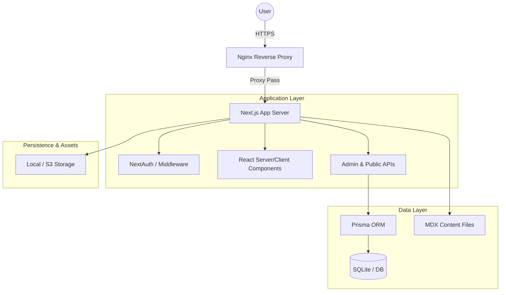

# Thompson Systems — Comprehensive Architecture & Integration Review
*Date: January 6, 2026*
*Auditor: GitHub Copilot (Gemini 3 Flash)*

---

## 1. Executive Summary
The application is a modern **Next.js 16+** enterprise platform utilizing the **App Router** architecture. It adheres to **SOLID** principles and separates concerns between Server Components (data fetching/logic) and Client Components (interactivity).

### Key Technologies
- **Next.js 16** (App Router, Server Actions)
- **React 19**
- **TypeScript 5.x**
- **Prisma ORM**
- **NextAuth.js v5**

---

## 2. Architecture Review

### 2.1 Component Integration
- **Frontend & Backend Connectivity**: 
  - Standard RESTful API communication via `app/api/admin/*` and `app/api/*`.
  - Server actions are not yet heavily utilized; most interactions follow the standard fetch-to-endpoint pattern.
- **API Configuration**:
  - API routes are well-defined with robust validation using **Zod**.
  - **CSRF Protection**: Consistent use of `assertSameOrigin` (from `lib/security/origin.ts`) in mutating endpoints.
  - **Data Flow**: Prisma handles the ORM layer smoothly with a well-indexed SQLite/PostgreSQL-ready schema.

### 2.2 Critical Connections
- **Auth Flow**: NextAuth handles session management. MFA is implemented for admin users (enable/disable/generate flows present).
- **Audit Logging**: Implemented across all administrative mutations (`lib/admin/audit.ts`). Immutable logs track actor activity, resource changes, and metadata.

---

## 3. Deployment Configuration

### 3.1 Current Setup (Self-Hosting Focused)
The application is pre-configured for deployment on a Linux VPS using a traditional yet hardened stack:
- **Nginx**: Reverse proxy (Config in `config/nginx/nginx.conf`) with HTTP-only port 80 (TLS/HTTPS expected via Let's Encrypt).
- **Systemd**: Primary service manager (`config/systemd/vantus.service`) for the Node.js process. Includes security hardening (PrivateTmp, ProtectSystem).
- **Supervisor**: Optional alternative process manager (`config/supervisor/vantus.conf`).

### 3.2 Cloud vs. Self-Hosting Concepts
- **Self-Hosting**: Full control, lower fixed costs, requires server management (Systemd, Nginx, backups).
- **Cloud (Vercel/Managed)**: Automated scaling, easier CI/CD, but potentially higher variable costs and less control over the underlying infrastructure (Nginx/System level).

---

## 4. Maintenance Infrastructure

### 4.1 Update Mechanisms
- **Frontend Components**: Centrally managed in `components/` using `shadcn/ui` patterns. Easy to swap or update via `components.json`.
- **Public Content**: Managed via **MDX** (files in `content/insights` and `content/work`). This allows for version-controlled, developer-friendly content updates with React component embedding.
- **Backend Services**: Extensible API structure under `app/api`. Business logic is moderately decoupled into `lib/` modules.

### 4.2 Content Management (CMS)
- The application includes an **Administrative Portal** for managing Leads, Projects, Media, and Content directly via a web UI (`app/(admin)/admin/(dashboard)`).
- **Media Asset Manager**: Integrated with a storage layer (`lib/storage.ts`) and audit trails.

---

## 5. Implementation Verification

### 5.1 Critical User Journeys
- **Lead Generation**: Verified via `AuditModal` and `lib/leads.ts`.
- **Admin Operations**: Comprehensive coverage for all CRUD operations on core entities.
- **Server Config Tool**: Located at `/lab/server-config`. It provides infra recommendations based on workload intents.
- **Test Suite Status**: ⚠️ **Critical Out-of-Sync**. Running `npm run test:e2e` reveals 16 failures out of 26 tests. 
  - *Root Cause*: Most failures are due to the transition from "Vantus Systems" to "Thompson Systems". The application has been updated, but the test expectations (titles, headings, specific text like "Digital Alchemy") still anticipate the legacy identity.
  - *Recommendation*: Perform a sweep of the `e2e/` directory to update selectors and assertions to match the current Thompson Systems UI.

### 5.2 Error Handling & Logging
- **Error Boundaries**: `app/error.tsx` and `app/global-error.tsx` provide basic catch-all UI and console logging.
- **Recommendation**: Integrate a production-grade error tracking service (e.g., Sentry) to move beyond console-only logging.

---

## 6. Recommendations & Findings

| Area | Status | Recommendation |
| :--- | :--- | :--- |
| **API Security** | ✅ Robust | Consider rate-limiting strategies beyond simple DB-backed tracking for high-traffic public routes. |
| **Error UX** | ⚠️ Basic | Improve user-facing error messages to be more context-aware and actionable. |
| **Diagnostics** | ⚠️ Limited | Implement a `/api/healthz` endpoint that checks DB connectivity and redis availability (if used). |
| **Scaling** | ✅ Good | The jump from SQLite to PostgreSQL is straightforward as Prisma is already configured for easy switching. |

---

## 7. Technical Diagrams (Wiring)

---

## 8. Areas Requiring Special Attention
- **MFA Flow**: Ensure `MFA_ENCRYPTION_KEY` is rotated periodically and backed up.
- **Media Uploads**: Private directory permissions for `/uploads` must be strictly managed if self-hosting.
- **DB Migrations**: Always run `prisma migrate deploy` as part of the Systemd `ExecStartPre` or CI/CD pipeline.
