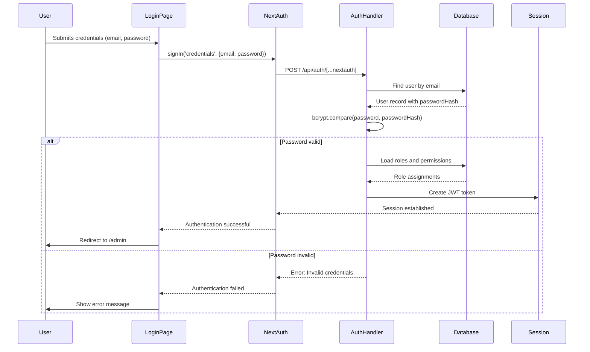
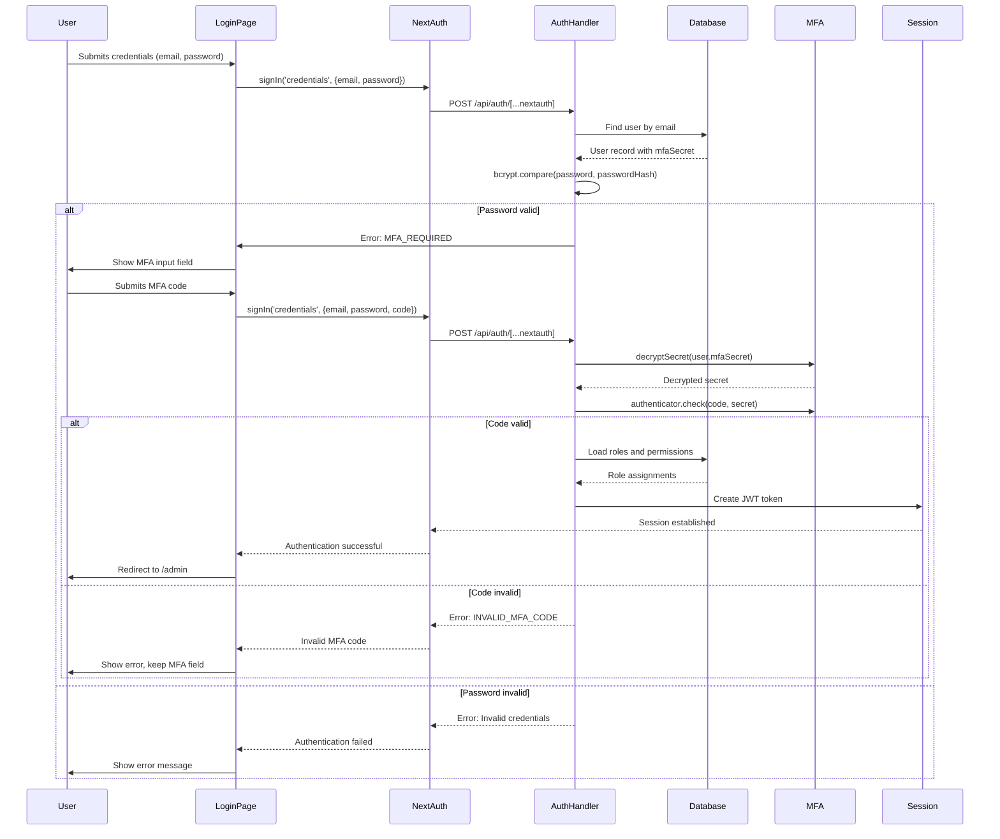
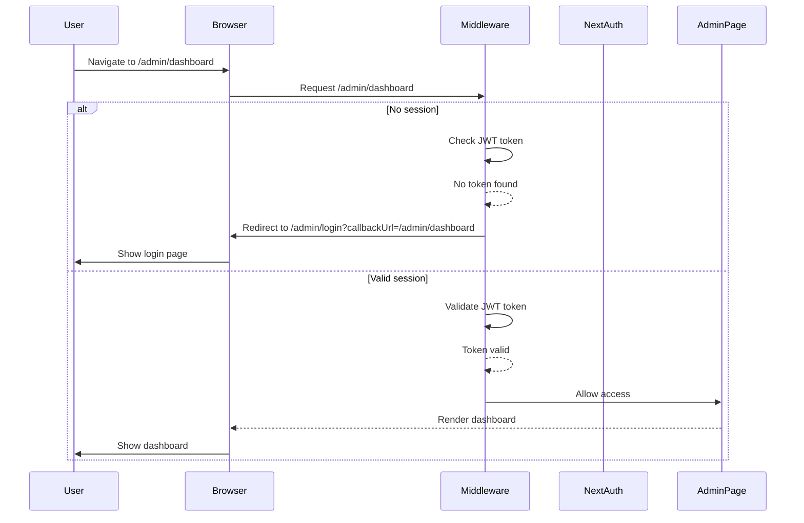

# Authentication and Login System Documentation

## Table of Contents

1. [Overview](#overview)
2. [Login Flow](#login-flow)
3. [Sequence Diagrams](#sequence-diagrams)
4. [Edge Cases](#edge-cases)
5. [Security Considerations](#security-considerations)
6. [Vulnerabilities and Weaknesses](#vulnerabilities-and-weaknesses)
7. [Recommendations for Improvements](#recommendations-for-improvements)

## Overview

The authentication system is built using NextAuth.js with a credentials provider, supporting both regular login and multi-factor authentication (MFA). The system includes:

- Two login pages: `/auth/login` and `/admin/login` (both functionally identical)
- JWT-based session management
- CSRF protection
- MFA support using TOTP
- Comprehensive security headers
- Role-based access control

## Login Flow

### 1. User Accesses Login Page

Users can access the login system through two entry points:
- [`/auth/login/page.tsx`](app/auth/login/page.tsx:1)
- [`/admin/login/page.tsx`](app/(admin)/admin/login/page.tsx:1)

Both pages use the same authentication logic and redirect to `/admin` upon successful login.

### 2. Credential Submission

When a user submits their credentials:

1. The form calls `signIn('credentials', { email, password, code })` from NextAuth
2. The credentials are sent to the NextAuth API endpoint at [`/api/auth/[...nextauth]/route.ts`](app/api/auth/[...nextauth]/route.ts:1)
3. The authentication logic in [`lib/auth.ts`](lib/auth.ts:1) processes the request

### 3. Authentication Process

The authentication flow in [`lib/auth.ts`](lib/auth.ts:93) follows these steps:

1. **Rate Limiting**: Apply IP and email-based rate limiting to prevent brute force attacks
2. **User Lookup**: Find user by email in the database
3. **Soft-Delete Check**: Verify user is not soft-deleted by checking `deletedAt` field
4. **Password Verification**: Compare hashed password using bcrypt
5. **MFA Check**: If user has MFA enabled, verify the TOTP code
6. **Role Assignment**: Load user roles and permissions
7. **Session Creation**: Generate JWT token with user data

**Code**: [`lib/auth.ts`](lib/auth.ts:115)

```typescript
// User lookup with soft-delete filter
const user = await prisma.user.findUnique({
  where: { email: credentials.email },
  include: {
    RoleAssignment: {
      include: { Role: true }
    }
  }
});

// Check if user is soft-deleted
if (user?.deletedAt) {
  return null; // Prevent login for soft-deleted users
}
```

### 4. MFA Flow

If a user has MFA enabled:

1. The system checks for the presence of `mfaSecret` in the user record
2. If no code is provided, it throws `MFA_REQUIRED` error
3. The login page shows the MFA input field
4. The system decrypts the stored MFA secret using [`lib/security/mfa.ts`](lib/security/mfa.ts:38)
5. Verifies the TOTP code using the `otplib` library
6. If invalid, throws `INVALID_MFA_CODE` error

### 5. Session Management

After successful authentication:

1. JWT token is created with user ID, roles, permissions, and tenant ID
2. Secure HTTP-only cookie is set with the session token
3. User is redirected to `/admin` or the specified callback URL

### 6. Admin Route Protection

The middleware in [`middleware.ts`](middleware.ts:41) protects admin routes:

1. Checks if path starts with `/admin` (excluding `/admin/login` and `/admin/error`)
2. Validates the JWT token using `getToken()`
3. If no token, redirects to `/admin/login` with callback URL
4. Applies security headers to all responses

## Sequence Diagrams

### Standard Login Flow



### MFA Login Flow



### Admin Route Protection Flow



## Edge Cases

### 1. Database Schema Not Ready

**Scenario**: The database schema is not properly migrated

**Handling**: 
- The system catches Prisma errors `P2021` (Table does not exist) and `P2022`
- Throws `DB_SCHEMA_NOT_READY` error
- Shows user-friendly message: "Database schema not ready; run prisma migrate deploy"

**Code**: [`lib/auth.ts`](lib/auth.ts:139)

### 2. Missing NEXTAUTH_SECRET

**Scenario**: `NEXTAUTH_SECRET` environment variable is not set

**Handling**:
- In production: System throws error and fails fast
- In development: System continues with warning but authentication may not work reliably

**Code**: [`lib/auth.ts`](lib/auth.ts:9)

### 3. MFA Decryption Failure

**Scenario**: MFA secret cannot be decrypted

**Handling**:
- Catches decryption errors
- Throws `MFA_ERROR` which is handled as invalid MFA code
- User can retry or contact support

**Code**: [`lib/security/mfa.ts`](lib/security/mfa.ts:55)

### 4. Callback URL Handling

**Scenario**: Invalid or malformed callback URL

**Handling**:
- Double URL encoding/decoding to handle special characters
- Try-catch block to handle decoding errors
- Fallback to `/admin` if decoding fails

**Code**: [`app/auth/login/page.tsx`](app/auth/login/page.tsx:85)

### 5. CSRF Token Validation

**Scenario**: Missing or invalid CSRF token

**Handling**:
- Validates both cookie and header tokens
- Uses constant-time comparison to prevent timing attacks
- Throws specific errors for missing/mismatched tokens

**Code**: [`lib/security/csrf.ts`](lib/security/csrf.ts:79)

### 6. Session Timeout During Login

**Scenario**: User already has valid session when accessing login page

**Handling**:
- `useEffect` hook checks session status
- If `status === 'authenticated'`, redirects to `/admin` after small delay
- Prevents unnecessary re-authentication

**Code**: [`app/auth/login/page.tsx`](app/auth/login/page.tsx:24)

### 7. Rate Limiting

**Implementation**:
- Redis-backed rate limiting for login attempts
- IP-based rate limiting: 5 attempts per minute
- Email-based rate limiting: 3 attempts per 15 minutes
- Combined IP and email checks in Credentials provider's authorize function
- Graceful fallback when Redis is unavailable

**Code**: [`lib/security/rate-limit.ts`](lib/security/rate-limit.ts:1) and [`lib/auth.ts`](lib/auth.ts:104)

## Security Considerations

### 1. Password Security

**Implementation**:
- Passwords stored as bcrypt hashes
- Minimum 12-character requirement
- Complexity requirements (uppercase, lowercase, numbers, special chars)
- Common password denial list
- **Enhanced Validation**: Entropy checking and breach detection via `validatePasswordEnhanced`

**Code**: [`lib/security/password-enhanced.ts`](lib/security/password-enhanced.ts:1)

### 2. Session Security

**Implementation**:
- JWT strategy with 30-day expiration
- Secure, HTTP-only cookies in production
- `__Secure-` prefix for session cookies in production
- SameSite=Lax cookie policy

**Code**: [`lib/auth.ts`](lib/auth.ts:40)

### 3. CSRF Protection

**Implementation**:
- Double-submit cookie pattern
- HMAC-signed tokens with SHA-256
- Constant-time comparison using `timingSafeEqual` from 'crypto'
- Required for all mutation requests (POST, PUT, PATCH, DELETE)

**Code**: [`lib/security/csrf.ts`](lib/security/csrf.ts:17)

### 4. Security Headers

**Implementation**:
- Content Security Policy (CSP) with nonce
- X-Content-Type-Options: nosniff
- X-Frame-Options: DENY
- Strict-Transport-Security (HSTS) - production only
- Referrer-Policy: strict-origin-when-cross-origin
- X-XSS-Protection: 1; mode=block

**Code**: [`middleware.ts`](middleware.ts:1)

## Recommendations for Improvements

### 1. ✅ Rate Limiting - IMPLEMENTED

### 2. ✅ Enhance Password Validation - IMPLEMENTED
Implemented via `lib/security/password-enhanced.ts`.

### 3. ✅ Implement Secure Secret Management - IMPLEMENTED
Enforced via `lib/auth.ts` `getAuthSecret`.

### 4. ✅ Add Security Logging - IMPLEMENTED
Audit logging added to sensitive operations.

### 5. Implement Session Timeout
Consider adding idle timeout logic in middleware or client-side.

### 6. ✅ Add IP-Based Security - IMPLEMENTED
Rate limiting uses IP.

## Conclusion

The authentication system has been significantly enhanced with comprehensive security measures:

### ✅ Implemented Security Enhancements:

1. **Rate Limiting**: Successfully implemented Redis-backed rate limiting with IP-based (5 attempts/minute) and email-based (3 attempts/15 minutes) protection against brute force attacks

2. **CSRF Protection**: Enhanced with proper `timingSafeEqual` import and constant-time comparison without TypeScript ignore comments

3. **Soft-Delete Filter**: Added user authentication flow that checks the `deletedAt` field before processing login requests

4. **CSP and HSTS**: Updated with development environment exceptions for WebSocket connections and production-only HSTS enforcement

5. **Middleware**: Restored and hardened `middleware.ts` for global security header enforcement.

### 🔒 Current Security Posture:

The system now includes:
- ✅ Rate limiting for login attempts
- ✅ CSRF protection with timing-safe comparison
- ✅ Soft-delete user filtering
- ✅ Environment-aware CSP and HSTS configuration
- ✅ MFA support using TOTP
- ✅ Secure session management with JWT
- ✅ Comprehensive security headers
- ✅ Path traversal protection
- ✅ Enhanced password validation

### 🎯 Remaining Recommendations:

1. **Medium**: Use generic error messages to prevent information leakage
2. **Low**: Implement stricter session timeout mechanisms (idle timeout)
