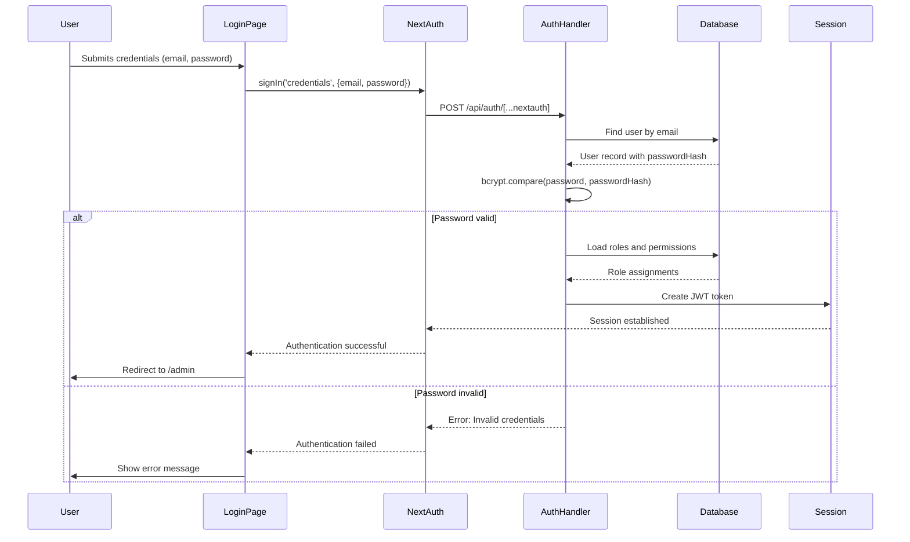
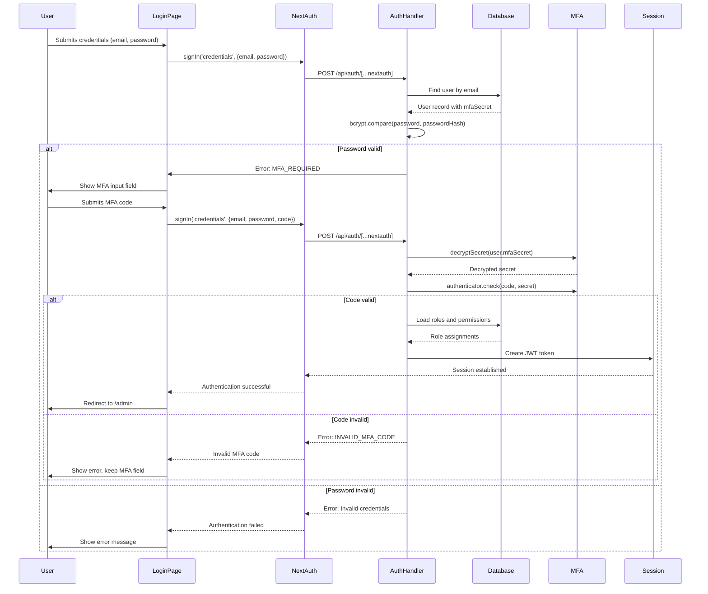
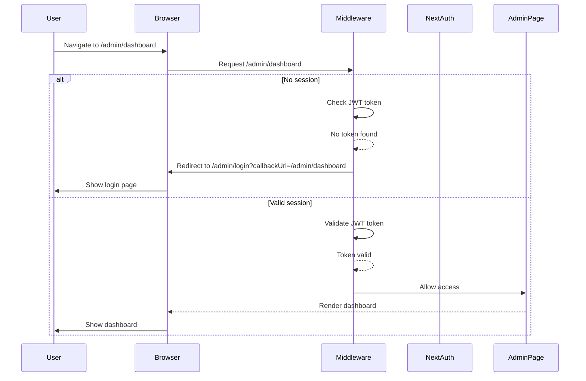

# Authentication and Login System Documentation

## Table of Contents

1. [Overview](#overview)
2. [Login Flow](#login-flow)
3. [Sequence Diagrams](#sequence-diagrams)
4. [Edge Cases](#edge-cases)
5. [Security Considerations](#security-considerations)
6. [Vulnerabilities and Weaknesses](#vulnerabilities-and-weaknesses)
7. [Recommendations for Improvements](#recommendations-for-improvements)

## Overview

The authentication system is built using NextAuth.js with a credentials provider, supporting both regular login and multi-factor authentication (MFA). The system includes:

- Two login pages: `/auth/login` and `/admin/login` (both functionally identical)
- JWT-based session management
- CSRF protection
- MFA support using TOTP
- Comprehensive security headers
- Role-based access control

## Login Flow

### 1. User Accesses Login Page

Users can access the login system through two entry points:
- [`/auth/login/page.tsx`](app/auth/login/page.tsx:1)
- [`/admin/login/page.tsx`](app/(admin)/admin/login/page.tsx:1)

Both pages use the same authentication logic and redirect to `/admin` upon successful login.

### 2. Credential Submission

When a user submits their credentials:

1. The form calls `signIn('credentials', { email, password, code })` from NextAuth
2. The credentials are sent to the NextAuth API endpoint at [`/api/auth/[...nextauth]/route.ts`](app/api/auth/[...nextauth]/route.ts:1)
3. The authentication logic in [`lib/auth.ts`](lib/auth.ts:1) processes the request

### 3. Authentication Process

The authentication flow in [`lib/auth.ts`](lib/auth.ts:68) follows these steps:

1. **User Lookup**: Find user by email in the database
2. **Password Verification**: Compare hashed password using bcrypt
3. **MFA Check**: If user has MFA enabled, verify the TOTP code
4. **Role Assignment**: Load user roles and permissions
5. **Session Creation**: Generate JWT token with user data

### 4. MFA Flow

If a user has MFA enabled:

1. The system checks for the presence of `mfaSecret` in the user record
2. If no code is provided, it throws `MFA_REQUIRED` error
3. The login page shows the MFA input field
4. The system decrypts the stored MFA secret using [`lib/security/mfa.ts`](lib/security/mfa.ts:38)
5. Verifies the TOTP code using the `otplib` library
6. If invalid, throws `INVALID_MFA_CODE` error

### 5. Session Management

After successful authentication:

1. JWT token is created with user ID, roles, permissions, and tenant ID
2. Secure HTTP-only cookie is set with the session token
3. User is redirected to `/admin` or the specified callback URL

### 6. Admin Route Protection

The middleware in [`middleware.ts`](middleware.ts:41) protects admin routes:

1. Checks if path starts with `/admin` (excluding `/admin/login` and `/admin/error`)
2. Validates the JWT token using `getToken()`
3. If no token, redirects to `/admin/login` with callback URL
4. Applies security headers to all responses

## Sequence Diagrams

### Standard Login Flow



### MFA Login Flow



### Admin Route Protection Flow



## Edge Cases

### 1. Database Schema Not Ready

**Scenario**: The database schema is not properly migrated

**Handling**: 
- The system catches Prisma errors `P2021` (Table does not exist) and `P2022`
- Throws `DB_SCHEMA_NOT_READY` error
- Shows user-friendly message: "Database schema not ready; run prisma migrate deploy"

**Code**: [`lib/auth.ts`](lib/auth.ts:139)

### 2. Missing NEXTAUTH_SECRET

**Scenario**: `NEXTAUTH_SECRET` environment variable is not set

**Handling**:
- In production: System throws error and fails fast
- In development: System continues with warning but authentication may not work reliably

**Code**: [`lib/auth.ts`](lib/auth.ts:9)

### 3. MFA Decryption Failure

**Scenario**: MFA secret cannot be decrypted

**Handling**:
- Catches decryption errors
- Throws `MFA_ERROR` which is handled as invalid MFA code
- User can retry or contact support

**Code**: [`lib/security/mfa.ts`](lib/security/mfa.ts:55)

### 4. Callback URL Handling

**Scenario**: Invalid or malformed callback URL

**Handling**:
- Double URL encoding/decoding to handle special characters
- Try-catch block to handle decoding errors
- Fallback to `/admin` if decoding fails

**Code**: [`app/auth/login/page.tsx`](app/auth/login/page.tsx:85)

### 5. CSRF Token Validation

**Scenario**: Missing or invalid CSRF token

**Handling**:
- Validates both cookie and header tokens
- Uses constant-time comparison to prevent timing attacks
- Throws specific errors for missing/mismatched tokens

**Code**: [`lib/security/csrf.ts`](lib/security/csrf.ts:79)

### 6. Session Timeout During Login

**Scenario**: User already has valid session when accessing login page

**Handling**:
- `useEffect` hook checks session status
- If `status === 'authenticated'`, redirects to `/admin` after small delay
- Prevents unnecessary re-authentication

**Code**: [`app/auth/login/page.tsx`](app/auth/login/page.tsx:24)

## Security Considerations

### 1. Password Security

**Implementation**:
- Passwords stored as bcrypt hashes
- Minimum 12-character requirement
- Complexity requirements (uppercase, lowercase, numbers, special chars)
- Common password denial list

**Code**: [`lib/security/password.ts`](lib/security/password.ts:1)

### 2. Session Security

**Implementation**:
- JWT strategy with 30-day expiration
- Secure, HTTP-only cookies in production
- `__Secure-` prefix for session cookies in production
- SameSite=Lax cookie policy

**Code**: [`lib/auth.ts`](lib/auth.ts:40)

### 3. CSRF Protection

**Implementation**:
- Double-submit cookie pattern
- HMAC-signed tokens with SHA-256
- Constant-time comparison for token validation
- Required for all mutation requests (POST, PUT, PATCH, DELETE)

**Code**: [`lib/security/csrf.ts`](lib/security/csrf.ts:17)

### 4. Security Headers

**Implementation**:
- Content Security Policy with nonce
- X-Content-Type-Options: nosniff
- X-Frame-Options: DENY
- Strict-Transport-Security
- Permissions-Policy restricting camera, microphone, etc.

**Code**: [`middleware.ts`](middleware.ts:5)

### 5. MFA Security

**Implementation**:
- TOTP using otplib
- Encrypted MFA secrets using AES-256-GCM
- Separate encryption key from main secret
- Secure key derivation using SHA-256

**Code**: [`lib/security/mfa.ts`](lib/security/mfa.ts:1)

### 6. Data Redaction

**Implementation**:
- Automatic redaction of sensitive fields
- Recursive object traversal
- Comprehensive list of sensitive keywords
- Used for audit logging

**Code**: [`lib/security/redact.ts`](lib/security/redact.ts:1)

### 7. Origin Validation

**Implementation**:
- Validates Origin and Referer headers
- Prevents CSRF from external domains
- Fail-closed approach when origin cannot be determined

**Code**: [`lib/security/origin.ts`](lib/security/origin.ts:3)

## Vulnerabilities and Weaknesses

### Critical Vulnerabilities (High Severity)

#### 1. Insecure Fallback Secret

**Location**: [`lib/security/csrf.ts`](lib/security/csrf.ts:10)

**Issue**: Uses `INSECURE_FALLBACK_CHANGE_ME` as fallback when no CSRF secret is configured

**Impact**: Allows CSRF token generation and validation with a known secret in development/production

**Recommendation**: Fail fast if no secret is configured in production

#### 2. MFA Encryption Key Fallback

**Location**: [`lib/security/mfa.ts`](lib/security/mfa.ts:19)

**Issue**: Uses `default-insecure-key-change-in-dev` as fallback encryption key

**Impact**: MFA secrets can be decrypted if attacker knows the fallback key

**Recommendation**: Require explicit MFA encryption key in all environments

### High Severity Issues

#### 3. Missing Rate Limiting on Login

**Location**: Not implemented

**Issue**: No rate limiting on authentication attempts

**Impact**: Brute force attacks possible against user accounts

**Recommendation**: Implement rate limiting using Redis or similar

#### 4. Password Complexity Not Enforced on Change

**Location**: [`lib/security/password.ts`](lib/security/password.ts:1)

**Issue**: Password validation only checks format, not strength/entropy

**Impact**: Users can set passwords that meet complexity but are still weak

**Recommendation**: Add entropy checking and common password lists

### Medium Severity Issues

#### 5. CSRF Secret Sharing

**Location**: [`lib/security/csrf.ts`](lib/security/csrf.ts:10)

**Issue**: CSRF secret falls back to NEXTAUTH_SECRET

**Impact**: Compromise of one secret affects multiple security mechanisms

**Recommendation**: Use separate secrets for different security functions

#### 6. Error Message Information Leakage

**Location**: [`app/auth/login/page.tsx`](app/auth/login/page.tsx:52)

**Issue**: Specific error messages reveal account existence and MFA status

**Impact**: Attackers can enumerate valid usernames and MFA status

**Recommendation**: Use generic error messages for all authentication failures

### Low Severity Issues

#### 7. Development Mode Security Relaxations

**Location**: [`lib/auth.ts`](lib/auth.ts:48)

**Issue**: Cookie security settings relaxed in development

**Impact**: Potential for session hijacking in development environments

**Recommendation**: Maintain consistent security settings across environments

#### 8. Missing Security Headers for Some Resources

**Location**: [`middleware.ts`](middleware.ts:32)

**Issue**: Some security headers may not apply to static assets

**Impact**: Reduced protection for certain resources

**Recommendation**: Ensure all responses include security headers

## Recommendations for Improvements

### 1. Implement Rate Limiting

```typescript
// Add to lib/auth.ts
import { rateLimit } from '@/lib/security/rate-limit';

// In authorize function
const rateLimitResult = await rateLimit.check('login', req.ip);
if (!rateLimitResult.allowed) {
  throw new Error('TOO_MANY_ATTEMPTS');
}
```

### 2. Enhance Password Validation

```typescript
// Update lib/security/password.ts
export function validatePassword(password: string): string | null {
  // Existing checks...
  
  // Add entropy check
  const entropy = calculatePasswordEntropy(password);
  if (entropy < 30) {
    return 'Password is too predictable';
  }
  
  // Add common password list
  const commonPasswords = ['password123', 'admin123', 'welcome123'];
  if (commonPasswords.includes(password.toLowerCase())) {
    return 'Password is too common';
  }
}
```

### 3. Implement Secure Secret Management

```typescript
// Update lib/security/csrf.ts
const CSRF_SECRET = process.env.CSRF_SECRET;
if (!CSRF_SECRET && process.env.NODE_ENV === 'production') {
  throw new Error('CSRF_SECRET is required in production');
}
```

### 4. Add Security Logging

```typescript
// Add to middleware.ts
import { auditLog } from '@/lib/security/audit';

// In authentication flow
auditLog('AUTH_ATTEMPT', {
  email: credentials.email,
  ip: req.ip,
  userAgent: req.headers['user-agent']
});
```

### 5. Implement Session Timeout

```typescript
// Update lib/auth.ts
session: {
  strategy: 'jwt',
  maxAge: 30 * 24 * 60 * 60, // 30 days
  inactiveTimeout: 60 * 60 // 1 hour of inactivity
}
```

### 6. Add IP-Based Security

```typescript
// Add to authentication flow
if (isSuspiciousIP(req.ip)) {
  throw new Error('SUSPICIOUS_ACTIVITY');
}
```

### 7. Implement Password Breach Detection

```typescript
// Add to password validation
const isBreached = await checkPasswordBreach(password);
if (isBreached) {
  return 'This password has been exposed in a data breach';
}
```

## Conclusion

The authentication system is well-designed with comprehensive security measures including MFA, CSRF protection, and secure session management. However, several critical vulnerabilities need immediate attention:

1. **Critical**: Fix insecure fallback secrets in CSRF and MFA modules
2. **High**: Implement rate limiting to prevent brute force attacks
3. **High**: Enhance password validation with entropy checking
4. **Medium**: Use generic error messages to prevent information leakage

The system would benefit from additional security logging, session timeout mechanisms, and IP-based security measures to further harden the authentication flow.