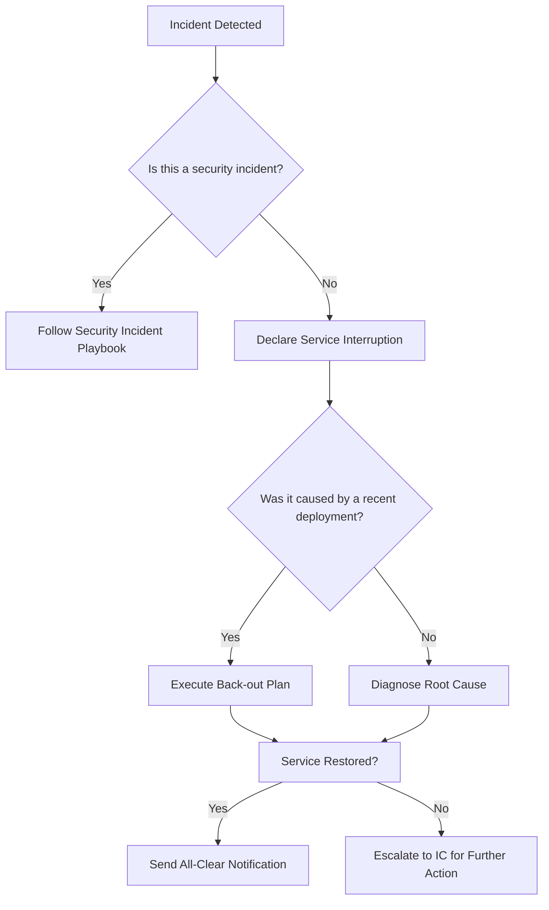

# SOP-003: Incident Response Playbook

**Document ID:** VS-OPS-003
**Version:** 2.1.0 (Fortune-500 Standard)
**Effective Date:** January 19, 2026
**Owner:** VP of Operations
**Related Documents:** `VS-OPS-502` (Operations Playbook), `VS-BUS-103` (Scope Management), `SOP-000` (SOP Framework)
**Last Reviewed:** January 19, 2026

This playbook outlines the procedure for handling service interruptions and security incidents. The primary goal is to **stabilize the system**, **protect the client**, and **communicate clearly**.

---

## I. PURPOSE & SCOPE

This SOP ensures that Vantus Systems can respond to incidents in a structured, efficient, and client-focused manner. It applies to all employees, contractors, and AI agents involved in incident response.

---

## II. KEY PRINCIPLES

This SOP aligns with the following Founding Principles:

1. **Universal Client Ownership:** Incident response procedures are designed to protect client systems and ensure they remain operational and secure.
2. **Empirical Veracity:** Incident response actions are based on measurable data and clear communication of facts.
3. **Foundational Integrity:** Security and stability are prioritized in all incident response actions.
4. **Radical Resilience:** Procedures are designed to work under real-world conditions, including system failures and human error.
5. **Linguistic Transparency:** Communication during incidents is clear, concise, and avoids technical jargon where possible.

---

## III. ROLES & RESPONSIBILITIES

- **Incident Commander (IC):** The VP of Operations or a designated senior engineer. The IC directs the response, makes critical decisions, and is the single source of truth for all communications.
- **Technical Lead (TL):** The engineer(s) responsible for diagnosing the root cause and implementing the fix.
- **Communications Lead (CL):** Usually the VP of Operations or Project Catalyst. Responsible for all communication with the client and internal stakeholders.

---

## IV. STEP-BY-STEP PROCEDURE

### Playbook 1: Service Interruption (e.g., Site Down, Feature Broken)

#### Phase 1: Triage & Declaration (First 5 Minutes)

1. **Acknowledge:** The first person to notice the issue immediately notifies the project channel (e.g., in Slack or Teams).
2. **Declare Incident:** The VP of Operations or a senior engineer declares an incident. A dedicated communication channel (e.g., a Slack huddle or a war room) is established.
3. **Assign Roles:** The Incident Commander is assigned and takes control.

#### Phase 2: Stabilize (5 - 60 Minutes)

1. **IC Priority:** The IC's first question is: **"What is the fastest path to stabilization?"**
2. **Rollback First:** If the incident was caused by a recent deployment, the immediate action is to execute the **Back-out Plan**. Do not attempt to "fix forward" unless a rollback is impossible.
3. **Identify & Remediate:** If not caused by a deployment, the TL investigates the root cause. The IC approves any remediation steps before they are taken. The goal is to restore service, not to find a perfect solution.

#### Phase 3: Communicate (During and After)

1. **Initial Client Notification (15 mins after declaration):** The CL sends a concise notification to the client's Decision Maker.
   - **Template:** "We are currently investigating a service interruption affecting [Feature/System]. Our team is working to restore service as quickly as possible. We will provide another update in 30 minutes or sooner."
2. **Regular Updates:** The CL provides updates at the promised intervals, even if there is no new information.
3. **All-Clear Notification:** Once the service is stable, the CL sends an "All Clear" message.
   - **Template:** "The service interruption has been resolved. The system is now stable. We are investigating the root cause and will provide a full post-mortem report within 24 hours."

#### Phase 4: Post-Mortem (Within 24 Hours)

1. **Create Post-Mortem Document:** The IC is responsible for creating a **blameless post-mortem**.
2. **The 5 Whys:** The document should focus on "why" the failure occurred, not "who" caused it.
3. **Action Items:** The post-mortem must include concrete action items to prevent the same class of incident from recurring. These are tracked as high-priority engineering tasks.

---

### Playbook 2: Security Incident (e.g., Data Leak, Unauthorized Access)

This follows the same phases as a Service Interruption, but with critical differences. **Urgency is paramount.**

1. **Declaration:** The incident is immediately declared as **Severity 1 / Security**.
2. **ISOLATE FIRST:** Before any other action, the TL's top priority is to **isolate the affected system** (e.g., take it offline, block IP addresses, revoke credentials).
3. **Preserve Evidence:** Do not destroy logs or virtual machines. Take snapshots for later forensic analysis.
4. **Communication:** Communication with the client must be handled with extreme care. The CL, in consultation with the IC, must be precise about what is known and what is being done. Do not speculate.
5. **Disclosure:** Follow the principle of "Veracity". Disclose the facts of the breach to the client and any affected parties as required by law and the client covenant.

---

## V. DECISION TREES

### Service Interruption Decision Tree



---

## VI. TEMPLATES & CHECKLISTS

### Incident Declaration Checklist

- [ ] Incident declared in the project channel.
- [ ] Dedicated communication channel established.
- [ ] Incident Commander assigned.
- [ ] Technical Lead assigned.
- [ ] Communications Lead assigned.

### Post-Mortem Template

```markdown
# Post-Mortem: [Incident Name]

**Date:** [Date]
**Incident Commander:** [Name]
**Technical Lead:** [Name]
**Communications Lead:** [Name]

## Summary

What happened?

## Timeline

- [Time]: Incident detected
- [Time]: Incident declared
- [Time]: Service restored
- [Time]: All-clear notification sent

## Root Cause

Why did this happen? (Use the 5 Whys technique.)

## Impact

- Duration: [X minutes/hours]
- Affected Systems: [List]
- Client Impact: [Description]

## Action Items

- [ ] Action 1
- [ ] Action 2
- [ ] Action 3

## Lessons Learned

What can we do better next time?
```

---

## VII. ESCALATION PATHS

| Issue                   | Primary Contact        | Secondary Contact |
| ----------------------- | ---------------------- | ----------------- |
| **Technical Issue**     | Technical Lead         | VP of Operations  |
| **Communication Issue** | Communications Lead    | VP of Operations  |
| **Security Incident**   | Chief Security Officer | CEO               |
| **Client Escalation**   | VP of Delivery         | CEO               |

---

## VIII. SUCCESS CRITERIA

- **Incident Response Time:** Incident declared within 5 minutes of detection.
- **Stabilization Time:** Service restored within 60 minutes for non-security incidents.
- **Communication:** Initial client notification within 15 minutes, regular updates every 30 minutes.
- **Post-Mortem:** Completed and shared within 24 hours.

---

## IX. AUDIT & COMPLIANCE

- **Audit Log:** All incidents are logged in the operations audit log.
- **Compliance Check:** The VP of Operations reviews incident response logs monthly to ensure compliance with this SOP.

---

## X. EXAMPLES & CASE STUDIES

### Example 1: Service Interruption Due to Deployment

**Scenario:** A deployment causes the website to go down.

**Response:**

1. Incident declared within 3 minutes.
2. Back-out plan executed, service restored in 10 minutes.
3. Initial client notification sent within 15 minutes.
4. Post-mortem completed and shared within 24 hours.

### Example 2: Security Incident Due to Unauthorized Access

**Scenario:** Unauthorized access detected in the system.

**Response:**

1. Incident declared as Severity 1 / Security.
2. Affected system isolated within 5 minutes.
3. Evidence preserved for forensic analysis.
4. Client notified with precise information, no speculation.

---

## XI. GLOSSARY

| Term                         | Definition                                                                                         |
| ---------------------------- | -------------------------------------------------------------------------------------------------- |
| **Incident Commander (IC)**  | The person responsible for directing the incident response.                                        |
| **Technical Lead (TL)**      | The engineer responsible for diagnosing and fixing the issue.                                      |
| **Communications Lead (CL)** | The person responsible for communicating with the client and internal stakeholders.                |
| **Back-out Plan**            | The procedure to roll back a deployment to a previous stable state.                                |
| **Post-Mortem**              | A blameless review of an incident to understand what happened and how to prevent it in the future. |

---

**Document History:**

- **v2.1.0** (Jan 19, 2026) — Aligned with SOP-000 framework, added decision trees, templates, and compliance section.
- **v1.0.0** (Jan 1, 2026) — Initial draft.

**Next Review Date:** July 19, 2026 (6 months)

---

_End of SOP-003. All incidents must be handled in accordance with this procedure._
