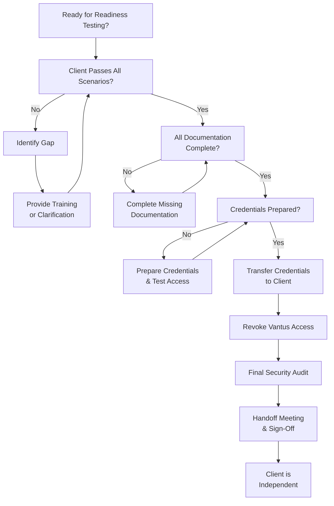

# SOP-006: Project Closeout & Knowledge Transfer

**Document ID:** VS-BUS-106  
**Version:** 1.0.0 (Fortune-500 Standard)  
**Effective Date:** January 18, 2026  
**Owner:** VP of Delivery / Project Catalyst  
**Related Documents:** `VS-GOV-001` (Governance), `SOP-004` (New Project Onboarding), `../founding-principles/OPS/OPERATIONS_PLAYBOOK.md`  
**Last Reviewed:** January 18, 2026

---

## I. PURPOSE & SCOPE

This SOP defines the procedure for completing a client engagement and handing off all assets, knowledge, and operational control to the client. **Closeout** is the final phase of every project and is as critical as the build phase. A poor closeout can undermine the entire engagement.

**Core Principle:** The client must leave with complete ownership and the capability to operate independently.

**Applies to:** Every client project upon completion (before Vantus team steps away).

---

## II. KEY PRINCIPLES

### Principle: Owner-Operability

- The client's team **must be able to operate the system independently** within 48 hours of Vantus's departure.
- All knowledge is documented and transferred (not hoarded).
- Runbooks exist for every operational procedure.

### Principle: Permanent Traceability

- All systems, configurations, and decisions are documented with diagrams and rationale (ADRs).
- The client has a complete map of their infrastructure.

### Principle: Empirical Veracity

- Readiness is verified through concrete tests (not just "we think they're ready").
- The client must demonstrate competency on all critical operations before handoff.

### Principle: Responsible Stewardship

- No dependencies on Vantus remain (except for optional support contracts).
- All credentials, secrets, and access are transferred to the client.
- Vantus code is open-sourced or handed over under appropriate license.

---

## III. ROLES & RESPONSIBILITIES

| Role                      | Responsibility                                                               |
| ------------------------- | ---------------------------------------------------------------------------- |
| **Project Catalyst (PC)** | Owns the closeout timeline; ensures all deliverables are completed.          |
| **Technical Lead (TL)**   | Leads knowledge transfer; verifies client readiness.                         |
| **Operations Engineer**   | Hands over all monitoring, backups, and operational runbooks.                |
| **Security Engineer**     | Revokes Vantus access; transfers all credentials; verifies security posture. |
| **Client Owner**          | Confirms readiness; signs off on handoff.                                    |
| **Client Technical Lead** | Participates in knowledge transfer; demonstrates competency.                 |

---

## IV. STEP-BY-STEP PROCEDURE

### **Phase 1: Closeout Planning (4 Weeks Before Go-Live)**

#### Step 1.1: Confirm Go-Live Date

- [ ] PC confirms the project's go-live date with the Client Owner.
- [ ] PC calculates the **Closeout Window** (typically 2–4 weeks before go-live):
  - Week 1: Finalize all documentation and runbooks.
  - Week 2: Knowledge transfer sessions.
  - Week 3: Client readiness testing.
  - Week 4: Final handoff and credential transfer.

#### Step 1.2: Create Closeout Checklist

- [ ] PC creates a **Closeout Master Checklist** (see Section VI):

**Typical Closeout Deliverables:**

- [ ] System architecture documentation (diagrams, rationale via ADRs).
- [ ] Runbook for every operational procedure (start, stop, deploy, incident response, backup).
- [ ] Database schema documentation and data dictionary.
- [ ] API documentation (if applicable).
- [ ] Security baseline verification (all security measures in place and tested).
- [ ] Monitoring and alerting setup (dashboards, on-call escalation).
- [ ] Disaster recovery plan and tested backup/restore procedure.
- [ ] Knowledge transfer curriculum and session schedule.
- [ ] Credential handoff (all access transferred to client; Vantus revokes all access).
- [ ] License documentation (open-source, proprietary, third-party).
- [ ] Support contract (if applicable) with SLA and escalation paths.

#### Step 1.3: Notify Stakeholders

- [ ] PC sends a **Closeout Announcement** to all team members:

```markdown
# Project Closeout Announcement: [Project Name]

**Go-Live Date:** [Date]  
**Closeout Window:** [Date] to [Date]  
**Closeout Owner:** [PC Name]

## Key Dates

- [Date]: Final features complete and tested.
- [Date]: Documentation finalized.
- [Date]: Knowledge transfer sessions begin.
- [Date]: Client readiness testing.
- [Date]: Final handoff and credential transfer.
- [Date]: Vantus team steps away (support only).

## Team Assignments

- **Technical Lead:** [Name] — Leads knowledge transfer.
- **Ops Engineer:** [Name] — Hands over monitoring and runbooks.
- **Security Engineer:** [Name] — Revokes access and transfers credentials.

Please confirm your availability for assigned activities.
```

---

### **Phase 2: Documentation & Runbook Creation (Weeks 1–2)**

#### Step 2.1: System Architecture Documentation

- [ ] TL creates comprehensive system documentation:

**Required Sections:**

1. **Architecture Overview Diagram** (services, databases, integrations).
2. **System Components** (description, purpose, dependencies).
3. **Data Flow Diagrams** (how data moves through the system).
4. **Architecture Decision Records (ADRs)** (why we chose this design).
5. **Deployment Pipeline** (how code gets from development to production).
6. **Infrastructure as Code (IaC)** (Terraform, CloudFormation, etc., version-controlled).
7. **Performance Benchmarks** (load capacity, response times, SLA).
8. **Security Measures** (authentication, encryption, secret management).
9. **Scalability Plan** (what happens when traffic grows).

**Guideline:** A competent software engineer with no prior knowledge of the system should be able to understand it fully from this documentation.

#### Step 2.2: Operational Runbooks

- [ ] Ops Engineer creates a **runbook for every operational procedure**:

**Standard Runbooks:**

```
1. Starting the System
   - Prerequisites (credentials, permissions).
   - Step-by-step startup sequence.
   - Verification (how to confirm system is running).
   - Troubleshooting (common startup issues).

2. Deploying Code
   - Prerequisites (git access, staging environment).
   - Deployment procedure (step-by-step).
   - Verification (automated tests; smoke tests).
   - Rollback procedure (if deployment fails).

3. Responding to Incidents (Incident Response Runbook)
   - How to detect an incident.
   - Incident severity levels and response procedures.
   - Escalation paths.
   - Post-incident procedures (blameless postmortem).

4. Backup & Restore
   - Backup schedule and location.
   - How to verify backups are working.
   - Disaster recovery procedure (step-by-step restore).
   - RTO / RPO (Recovery Time / Recovery Point Objectives).

5. Scaling & Capacity Planning
   - How to monitor system capacity.
   - When and how to scale resources.
   - Cost implications of scaling.

6. Secret Rotation
   - Which secrets need rotation and on what schedule.
   - How to rotate each secret type.
   - Verification (confirm new secrets are working).

7. Third-Party Service Management
   - If integrated with external services (payment processors, email, etc.).
   - How to verify integrations are working.
   - What to do if a third-party service goes down.
```

**Format:** Each runbook should be:

- **Clear and actionable** (not conceptual).
- **Step-numbered** (so there's no ambiguity).
- **Tested** (the client will test these during readiness testing).
- **Troubleshooting section** (common issues and solutions).

#### Step 2.3: Database & API Documentation

- [ ] Database Engineer documents:
  1. **Schema diagram** (tables, relationships, primary/foreign keys).
  2. **Data dictionary** (every column: type, constraints, examples).
  3. **Critical queries** (how data is typically accessed).
  4. **Backup and restore procedures** (specific to their database technology).

- [ ] API Engineer documents:
  1. **API overview** (endpoints, authentication, rate limits).
  2. **Every endpoint** (method, path, parameters, response).
  3. **Error codes** (what each error means, how to debug).
  4. **Authentication** (how to obtain API keys; how to rotate them).
  5. **Examples** (curl commands or code samples for common operations).

#### Step 2.4: Security Posture Documentation

- [ ] Security Engineer documents:
  1. **Authentication mechanism** (how users log in, MFA, SSO).
  2. **Authorization model** (roles, permissions, access control).
  3. **Encryption** (data in transit and at rest; key management).
  4. **Compliance status** (SOC 2, HIPAA, GDPR, etc.).
  5. **Vulnerability scanning** (automated scanning, patch schedule).
  6. **Secrets management** (where credentials are stored, rotation schedule).
  7. **Incident response** (how to respond to security incidents).

---

### **Phase 3: Knowledge Transfer Sessions (Week 2–3)**

#### Step 3.1: Design Knowledge Transfer Curriculum

- [ ] TL designs a **Knowledge Transfer Curriculum**:

**Sample Curriculum (Adjust Based on Project):**

| Session # | Topic                                          | Duration | Audience             | Instructor        |
| --------- | ---------------------------------------------- | -------- | -------------------- | ----------------- |
| 1         | System Architecture & Design Decisions         | 2 hrs    | Client tech team     | TL                |
| 2         | Running Operationally (Deployment, Monitoring) | 3 hrs    | Client ops team      | Ops Engineer      |
| 3         | Incident Response Playbook                     | 2 hrs    | Client ops team      | TL + Ops Engineer |
| 4         | Database Administration & Troubleshooting      | 2 hrs    | Client DBA           | Database Engineer |
| 5         | Code Structure & Deployment Pipeline           | 2 hrs    | Client dev team      | TL                |
| 6         | Security Baseline & Secret Management          | 2 hrs    | Client security team | Security Engineer |
| 7         | Disaster Recovery Drill                        | 3 hrs    | Client ops team      | Ops Engineer      |
| 8         | Q&A and Final Readiness Check                  | 1 hr     | All stakeholders     | TL                |

**Total:** 17 hours over 2 weeks (distributed to avoid overwhelming the client).

#### Step 3.2: Conduct Knowledge Transfer Sessions

- [ ] For each session:
  1. **Prepare:** Instructor reviews documentation and prepares slides/live demo.
  2. **Deliver:**
     - Explain the topic (20 min).
     - Live demonstration (30–60 min).
     - Q&A (remaining time).
  3. **Document:** Attendees take notes; any clarifications are added to runbooks.
  4. **Verify:** Attendees understand; ask them to repeat back key concepts.

#### Step 3.3: Hands-On Labs

- [ ] For critical topics (incident response, disaster recovery), include **hands-on labs**:

**Example: Disaster Recovery Drill**

- Ops Engineer schedules a **2-hour lab** with the client team.
- Scenario: "Your production database is corrupted. Recover from backup."
- Client team executes the restore runbook while Ops Engineer observes.
- Ops Engineer provides feedback: "Good. Next time, verify the backup BEFORE you start the restore."

---

### **Phase 4: Client Readiness Testing (Week 3)**

#### Step 4.1: Readiness Checklist

- [ ] TL and Client Technical Lead jointly complete the **Readiness Checklist**:

```markdown
# Client Readiness Checklist: [Project Name]

**Date:** [Date]  
**Client Technical Lead:** [Name]  
**Vantus Technical Lead:** [Name]

## Knowledge Verification

- [ ] Client team can describe the system architecture.
- [ ] Client team can deploy code to production.
- [ ] Client team can respond to incidents using the runbook.
- [ ] Client team can restore from backup.
- [ ] Client team can scale the system if needed.
- [ ] Client team can rotate secrets.

## Documentation Verification

- [ ] Architecture documentation is clear and complete.
- [ ] Runbooks are step-by-step and tested.
- [ ] API documentation is accurate and includes examples.
- [ ] Database schema is documented.
- [ ] All ADRs are in place and explain design decisions.

## Operational Verification

- [ ] Monitoring and alerting are configured and working.
- [ ] Backup/restore has been tested and works.
- [ ] Incident escalation paths are documented and tested.
- [ ] Performance is meeting SLA.
- [ ] Security baseline is in place (no critical vulnerabilities).

## Sign-Off

**Client Technical Lead:** I confirm that my team is ready to operate this system independently.  
Signature: **\*\*\*\***\_**\*\*\*\*** Date: \***\*\_\*\***

**Vantus Technical Lead:** I confirm that the client team has demonstrated competency in all critical operations.  
Signature: **\*\*\*\***\_**\*\*\*\*** Date: \***\*\_\*\***
```

#### Step 4.2: Simulation Exercises

- [ ] Run **real scenarios** to test readiness:

**Scenarios to Test:**

1. **Incident Scenario:** "A customer reports the API is down. Walk us through your response."
   - Client responds: Checks monitoring, reviews logs, identifies issue, escalates if needed.
   - Vantus observes and provides feedback.

2. **Deployment Scenario:** "You have a critical bug fix. Deploy it to production."
   - Client executes: Checks out code, runs tests, deploys, verifies.
   - Vantus observes and provides feedback.

3. **Scaling Scenario:** "Traffic has doubled. What do you do?"
   - Client responds: Reviews capacity, scales resources, verifies performance.
   - Vantus observes and provides feedback.

#### Step 4.3: Readiness Assessment

- [ ] If the client fails any scenario:
  - **Do not proceed to handoff.**
  - Identify the gap (missing knowledge, unclear runbook, missing tool access).
  - Provide additional training or clarification.
  - Reschedule the scenario test.
  - Delay go-live if necessary (safety > schedule).

- [ ] Once the client passes all scenarios:
  - **Mark as "Ready"** in the Readiness Checklist.
  - Proceed to Phase 5: Credential Handoff.

---

### **Phase 5: Credential Handoff & Access Revocation (Week 4)**

#### Step 5.1: Prepare Credentials for Client

- [ ] Security Engineer prepares **all credentials** for handoff:
  - Database passwords.
  - API keys and tokens.
  - SSH keys and VPN credentials.
  - Cloud account credentials (AWS root account, etc.).
  - SSL certificates.
  - Vault access (client will manage their own secrets going forward).

#### Step 5.2: Secure Credential Transfer

- [ ] **Never send credentials via email or chat.**
- [ ] Use a **secure, temporary credential repository**:
  - Example: Temporary Vault instance; client imports credentials into their own Vault.
  - Or: Encrypted USB drive (hand-delivered).
  - Or: In-person meeting (verbally confirm critical passwords).

- [ ] Step-by-step handoff:
  1. Client designates a **Credential Manager** (responsible person).
  2. Vantus sets up **temporary access** for the client to retrieve credentials.
  3. Client imports credentials into their own credential management system.
  4. Client verifies credentials work (test authentication, run a query, etc.).
  5. Client confirms receipt: "We have all credentials and they are working."
  6. Vantus **revokes all temporary access** and Vault secrets.

#### Step 5.3: Revoke Vantus Access

- [ ] Security Engineer revokes **ALL Vantus access**:
  - [ ] Vantus engineers' access to production database.
  - [ ] Vantus engineers' access to production servers.
  - [ ] Vantus engineers' access to client cloud accounts (AWS, Azure, GCP).
  - [ ] Vantus engineers' access to client repositories (GitHub, GitLab).
  - [ ] Vantus team members from client Slack/Teams/email lists (if applicable).

- [ ] **Verification:** Security Engineer confirms:
  - Vantus access is completely revoked.
  - Client can still access all systems (their credentials work).
  - Audit logs show the revocation (immutable record).

#### Step 5.4: Final Security Audit

- [ ] Security Engineer performs a **final security audit**:
  - [ ] No Vantus secrets or credentials remain in the client's systems.
  - [ ] No Vantus SSH keys remain.
  - [ ] No Vantus MFA devices remain.
  - [ ] Security baseline is maintained (no new vulnerabilities introduced).

---

### **Phase 6: Final Handoff & Sign-Off (Day 1 of Independence)**

#### Step 6.1: Handoff Meeting

- [ ] PC conducts a **Handoff Meeting** with the Client Owner and Technical Lead:
  - Confirm all deliverables are complete.
  - Confirm all credentials have been transferred.
  - Confirm Vantus access has been revoked.
  - Discuss support options (if any).
  - Discuss escalation paths for future questions.

#### Step 6.2: Sign-Off Documentation

- [ ] Client Owner signs a **Closeout Sign-Off Document**:

```markdown
# Project Closeout Sign-Off: [Project Name]

**Project ID:** [ID]  
**Completion Date:** [Date]  
**Client Owner:** [Name]

## Deliverables Confirmation

- [ ] System is deployed and running in production.
- [ ] All code is in the client's repository.
- [ ] All documentation is complete and accessible.
- [ ] All credentials have been transferred to the client.
- [ ] All Vantus access has been revoked.

## Client Confirmation

The client's technical team has demonstrated competency in:

- [ ] Deploying code to production.
- [ ] Responding to incidents.
- [ ] Scaling the system.
- [ ] Performing backup and disaster recovery.

## Support Options

- [ ] Email support: [Vantus contact] ([SLA, if applicable])
- [ ] Retainer support: [Hours/month], [Cost/month]
- [ ] No ongoing support (client is fully independent).

## Final Sign-Off

I confirm that the client is ready to operate this system independently, and Vantus has successfully completed all deliverables.

**Client Owner:**  
Signature: **\*\*\*\***\_**\*\*\*\*** Date: \***\*\_\*\***

**Vantus Project Catalyst:**  
Signature: **\*\*\*\***\_**\*\*\*\*** Date: \***\*\_\*\***
```

#### Step 6.3: Knowledge Transfer Certificate (Optional)

- [ ] TL issues a **Knowledge Transfer Certificate** to the client team:

```
This certifies that [Client Team Member] has successfully completed
knowledge transfer for [Project Name] and has demonstrated competency
in the operation, maintenance, and support of the system.

Issued: [Date]
Vantus Systems

Signed: _________________ (Technical Lead)
```

---

### **Phase 7: Post-Handoff Support (Ongoing)**

#### Step 7.1: Grace Period (First 2 Weeks)

- [ ] If a support contract exists, provide **enhanced support for 2 weeks** post-handoff:
  - Client can ask questions; Vantus responds within 4 business hours.
  - Vantus monitors system health and proactively alerts client to issues.
  - Focus: Help client transition to independence; don't create dependency.

#### Step 7.2: Transition to Standard Support

- [ ] After 2 weeks, transition to the agreed-upon support model:
  - **No Support:** Vantus steps away entirely; client is responsible.
  - **Email Support:** Client can email questions; response time per SLA.
  - **Retainer Support:** Client has a fixed number of hours/month for support and questions.

#### Step 7.3: Periodic Check-In (Optional)

- [ ] PC schedules a **30-minute check-in call** 30 days post-handoff:
  - "How is everything going?"
  - "Are there any systemic issues we didn't anticipate?"
  - "Do you need any clarification on the runbooks or documentation?"
  - Use feedback to improve future projects.

---

## V. DECISION TREE: Readiness Assessment



---

## VI. TEMPLATES & CHECKLISTS

### Closeout Master Checklist

- [ ] **Documentation**
  - [ ] Architecture documentation (with ADRs).
  - [ ] Operational runbooks (start, stop, deploy, incident, backup, scaling, secrets).
  - [ ] Database documentation (schema, data dictionary, backup/restore).
  - [ ] API documentation (endpoints, authentication, examples).
  - [ ] Security documentation (baseline, secrets, incident response).
  - [ ] Deployment pipeline documentation.
  - [ ] Code comments and in-code documentation.

- [ ] **Knowledge Transfer**
  - [ ] Knowledge transfer curriculum designed.
  - [ ] All sessions scheduled with client.
  - [ ] All sessions completed.
  - [ ] Client team understands architecture and operations.

- [ ] **Readiness Testing**
  - [ ] Readiness checklist completed.
  - [ ] Client passes all scenario exercises.
  - [ ] Client demonstrates competency in critical operations.

- [ ] **Credential Handoff**
  - [ ] All credentials prepared and verified.
  - [ ] Credentials transferred to client securely.
  - [ ] Client verifies all credentials work.
  - [ ] Vantus revokes all access.
  - [ ] Final security audit passed.

- [ ] **Sign-Off & Support**
  - [ ] Handoff meeting conducted.
  - [ ] Closeout sign-off document signed.
  - [ ] Support options documented.
  - [ ] Grace period and transition plan confirmed.

### Knowledge Transfer Attendance Log

```markdown
# Knowledge Transfer Attendance Log: [Project Name]

| Session | Topic        | Date   | Vantus Instructor | Client Attendees | Notes       |
| ------- | ------------ | ------ | ----------------- | ---------------- | ----------- |
| 1       | Architecture | [Date] | [Name]            | [Names]          | [Any gaps?] |
| 2       | Operations   | [Date] | [Name]            | [Names]          | [Any gaps?] |
| 3       | Incidents    | [Date] | [Name]            | [Names]          | [Any gaps?] |
```

### Readiness Checklist

[See Section IV, Step 4.1]

---

## VII. ESCALATION PATHS

| Situation                                       | Escalate To                                      | Timeline                                |
| ----------------------------------------------- | ------------------------------------------------ | --------------------------------------- |
| Client fails readiness testing                  | VP of Delivery + Client Owner                    | Within 24 hours                         |
| Documentation is incomplete                     | TL + PC                                          | Immediately; delay handoff if necessary |
| Credentials cannot be securely transferred      | CISO + PC                                        | Immediately                             |
| Client disagrees with readiness assessment      | Client Owner + VP of Delivery                    | Within 48 hours                         |
| Post-handoff critical issue (client needs help) | VP of Delivery + TL (if support contract exists) | Immediately                             |

---

## VIII. SUCCESS CRITERIA

**Closeout is "Done" when:**

1. ✅ Client team has demonstrated competency in all critical operations.
2. ✅ All documentation is complete, clear, and tested.
3. ✅ All credentials have been transferred; Vantus has no production access.
4. ✅ Final security audit passes.
5. ✅ Client Owner has signed the Closeout Sign-Off Document.
6. ✅ Support model is documented (none, email, retainer).
7. ✅ Client is operating the system independently.

**Audit:** Review the signed Closeout Sign-Off and confirm all criteria are met.

---

## IX. AUDIT & COMPLIANCE

### Audit Checklist (Post-Closeout)

- [ ] Closeout Sign-Off document is signed by Client Owner.
- [ ] All deliverables listed in the Scope Document are in the Closeout Checklist.
- [ ] Readiness Checklist is signed by both parties.
- [ ] Vantus access is completely revoked (verified by Security Engineer).
- [ ] Knowledge transfer sessions are documented.
- [ ] Support model is documented.

### Compliance Log

Create a closeout audit log entry in the domain audit-log location used by the team.

```markdown
# Project Closeout Audit Log

| Project   | Closeout Date | Signed | Days to Independence | Support Model | Notes         |
| --------- | ------------- | ------ | -------------------- | ------------- | ------------- |
| [Project] | [Date]        | Yes    | [#]                  | [Model]       | [Any issues?] |
```

---

## X. EXAMPLES & CASE STUDIES

### Example 1: Successful Closeout (6-Week Project)

**Project:** E-commerce Platform for RetailCorp

**Timeline:**

- **Week 1 (Docs):** Architecture docs, runbooks created.
- **Week 2 (Training):** Knowledge transfer sessions (8 sessions, client team attending).
- **Week 3 (Testing):** Client passes incident response, deployment, and backup/restore drills.
- **Week 4 (Handoff):** Credentials transferred; Vantus access revoked; signed off.

**Outcome:**

- Client team is independent.
- No critical issues in first 2 weeks.
- 30-day check-in: "Everything is running smoothly. No help needed."

---

### Example 2: Closeout Delayed (Client Not Ready)

**Project:** Financial System for BankCorp

**Week 3 (Readiness Testing):**

- Client fails the "Incident Response" scenario.
- Client doesn't know how to escalate to the on-call engineer.

**Response:**

- TL adds an extra training session on escalation procedures.
- Client re-runs the incident response scenario (passes).
- Handoff is delayed by 1 week.

**Lesson:** Better to delay handoff than to hand off a system the client can't operate.

---

## XI. GLOSSARY

| Term                   | Definition                                                                           |
| ---------------------- | ------------------------------------------------------------------------------------ |
| **Go-Live**            | The date the system transitions from Vantus ownership to client ownership.           |
| **Readiness**          | Client team has demonstrated they can operate the system independently.              |
| **Knowledge Transfer** | The process of teaching the client how to operate, maintain, and support the system. |
| **Runbook**            | Step-by-step procedures for operational tasks (deployment, incident response, etc.). |
| **Closeout Sign-Off**  | Formal document signed by both client and Vantus confirming handoff is complete.     |
| **ADR**                | Architecture Decision Record; documents why a design decision was made.              |

---

**Document History:**

- **v1.0.0** (Jan 18, 2026) — Initial publication; comprehensive closeout and knowledge transfer framework.

**Next Review Date:** July 18, 2026

_End of SOP-006. All projects must complete closeout using this procedure before Vantus steps away._
