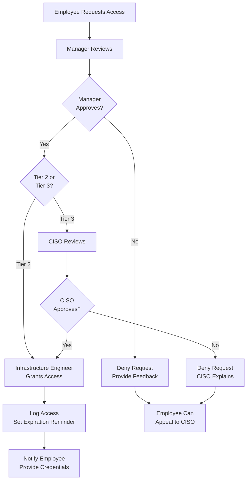

# SOP-030: Access Control & Secret Management

**Document ID:** VS-SEC-301  
**Version:** 1.0.0 (Fortune-500 Standard)  
**Effective Date:** January 18, 2026  
**Owner:** Chief Security Officer / CISO  
**Related Documents:** `VS-VAL-201` (Core Values), `../founding-principles/SECURITY/SECURITY_BASELINE.md`, `../founding-principles/ENGINEERING/REPO_CONVENTIONS.md`  
**Last Reviewed:** January 18, 2026

---

## I. PURPOSE & SCOPE

This SOP establishes the procedures for managing access to Vantus Systems infrastructure, source code, and secrets. It implements the principle of **Least Privilege**: every employee, contractor, and client has the minimum access necessary to perform their role.

**Applies to:**

- All Vantus employees and contractors.
- All client-owned infrastructure (where Vantus has administrative access).
- All source code repositories (internal and client).
- All production secrets (API keys, database credentials, SSL certificates).

---

## II. KEY PRINCIPLES

### Principle: Zero-Trust Security

- No access is granted by default.
- Every access request must be justified and approved.
- Access is regularly audited and revoked if no longer needed.

### Principle: Empirical Veracity

- All access is logged (immutable audit trail).
- Access violations are detected and escalated immediately.
- We audit and report on compliance quarterly.

### Principle: Permanent Traceability

- Every secret is versioned and rotated on a schedule.
- Every access grant/revoke is timestamped and approved.
- We can answer "Who accessed what, when, and why?" for any system.

### Principle: Responsible Stewardship

- Secrets are never shared via email or chat.
- Client credentials are segregated from Vantus credentials.
- Off-boarded employees lose access immediately.

---

## III. ROLES & RESPONSIBILITIES

| Role                        | Responsibility                                                           |
| --------------------------- | ------------------------------------------------------------------------ |
| **CISO**                    | Owns the access control policy; approves exceptions; reviews audit logs. |
| **Infrastructure Engineer** | Grants/revokes access; rotates secrets; manages vaults.                  |
| **Project Catalyst**        | Requests access for their team; documents business justification.        |
| **Manager / Team Lead**     | Approves access requests for their direct reports.                       |
| **Employee / Contractor**   | Requests access; uses credentials securely; reports suspicious activity. |

---

## IV. STEP-BY-STEP PROCEDURE

### **Phase 1: Access Classification**

#### Step 1.1: Identify All Systems

- [ ] Vantus classifies all systems into three tiers:

| Tier                  | Examples                                               | Access Control             | Audit Frequency |
| --------------------- | ------------------------------------------------------ | -------------------------- | --------------- |
| **Tier 1: Public**    | Public website, documentation                          | Open to public             | Not sensitive   |
| **Tier 2: Internal**  | Internal documentation, non-sensitive project repos    | Vantus employees only      | Monthly         |
| **Tier 3: Sensitive** | Production systems, client credentials, financial data | Explicit approval required | Weekly          |

---

### **Phase 2: Access Request Process**

#### Step 2.1: Request Access

**When:** An employee needs access to a Tier 2 or Tier 3 system.

- [ ] Employee submits an **Access Request Form** (template below) to their manager:

```markdown
# Access Request Form

**Employee:** [Name]  
**Role:** [Title]  
**Team:** [Department]  
**Date Requested:** [Date]

## Access Details

**System/Repository:** [e.g., "Production Kubernetes Cluster"]  
**Type of Access:** [Read-only / Admin / Other]  
**Duration:** [Permanent / Until [Date] / Other]  
**Business Justification:** [Why do you need this access?]

## Examples of Justification

- "I am the on-call engineer for the Q1 2026 project and need access to incident logs."
- "I am on-boarding to the infrastructure team and need read-only access to learn."
- "I need to deploy new features to the staging environment."

**Manager Approval:**  
Signature: **\*\*\*\***\_**\*\*\*\*** Date: \***\*\_\*\***  
(Manager confirms: employee needs this access, and it aligns with their role.)
```

#### Step 2.2: Manager Review

- [ ] **Manager's Role:**
  1. Verify that the access aligns with the employee's role.
  2. Verify that the justification is legitimate.
  3. Ensure the duration is appropriate (not "permanent" if temporary is sufficient).
  4. **Approve** or **Deny** and return to employee with feedback.

#### Step 2.3: CISO Review (Tier 3 Only)

- [ ] **For Tier 3 systems only**, the CISO must review and approve:
  1. Is the duration necessary?
  2. Is the access level minimal (e.g., read-only instead of admin)?
  3. Are there any security concerns?

- [ ] **CISO Decision:** Approve, Approve with Conditions, or Deny.
  - **Deny Example:** "This employee's access to production database credentials is not necessary. They should request access through their manager via the application's API, not direct credential access."

#### Step 2.4: Infrastructure Engineer Grants Access

- [ ] Once approved, the Infrastructure Engineer:
  1. Creates the access grant in the appropriate system (GitHub, AWS IAM, Vault, etc.).
  2. **Logs the action** with timestamp, approver, and justification.
  3. Notifies the employee: "Access granted. Here are your credentials [via secure channel]."
  4. Sets a **reminder** to revoke the access on the expiration date (if not permanent).

---

### **Phase 3: Secret Management**

#### Step 3.1: Classification of Secrets

- [ ] All secrets are classified:

| Classification        | Examples                                  | Rotation             | Storage                        |
| --------------------- | ----------------------------------------- | -------------------- | ------------------------------ |
| **Level 1: Public**   | API docs, public API keys                 | Never                | Source control (not a secret)  |
| **Level 2: Internal** | Internal API keys, test credentials       | Quarterly            | Vault (restricted to Vantus)   |
| **Level 3: Client**   | Client database passwords, API keys       | Monthly              | Vault (isolated per client)    |
| **Level 4: Critical** | Production admin credentials, Master keys | Monthly or on-demand | Vault (MFA required to access) |

#### Step 3.2: Secret Generation & Storage

- [ ] **Never hardcode secrets in source code.**
- [ ] **Every secret must be stored in a centralized vault** (e.g., HashiCorp Vault, AWS Secrets Manager).
- [ ] **Vault access requires authentication** (employee login + MFA).

**How to Handle a Secret:**

1. **Generate the secret** (e.g., generate a new API key in AWS).
2. **Immediately store it in Vault**, never via email or chat.
3. **Reference the secret by ID** in your code:
   ```python
   import os
   api_key = os.getenv("VAULT_API_KEY_PROD")  # Loaded from Vault at runtime
   ```
4. **Never log the secret**, even in error messages.
5. **Delete the secret from your clipboard** (or use a clipboard manager that auto-clears).

#### Step 3.3: Secret Rotation Schedule

| Secret Type            | Rotation Frequency         | Process                                                                    |
| ---------------------- | -------------------------- | -------------------------------------------------------------------------- |
| **API Keys**           | Quarterly                  | Generate new key, update Vault, revoke old key, test in staging.           |
| **Database Passwords** | Monthly                    | Generate new password, update Vault, test connection, revoke old password. |
| **SSL Certificates**   | 60 days before expiry      | Renew certificate authority, update Vault, deploy to production.           |
| **Master/Root Keys**   | Annually or after incident | Full security audit; rotate with CISO approval.                            |

**Rotation Procedure:**

1. [ ] Infrastructure Engineer generates a new secret.
2. [ ] Stores new secret in Vault with a timestamp.
3. [ ] Updates all systems to use the new secret (via Vault).
4. [ ] Waits 24 hours; verifies systems are using the new secret.
5. [ ] **Revokes the old secret** irreversibly.
6. [ ] Logs the rotation (timestamp, reason, who approved).

---

### **Phase 4: Audit & Revocation**

#### Step 4.1: Monthly Access Audit

- [ ] Infrastructure Engineer generates a **Monthly Access Report**:

```markdown
# Monthly Access Audit Report — [Month/Year]

## Summary

- Total users with Tier 2+ access: X
- New access grants this month: X
- Revoked this month: X
- Policy violations: X (none, [list violations])

## Access by Tier

### Tier 2: Internal Systems

| User   | System   | Access Level | Duration   | Approver   | Last Audit |
| ------ | -------- | ------------ | ---------- | ---------- | ---------- |
| [Name] | [System] | [Level]      | [Duration] | [Approver] | [Date]     |

### Tier 3: Sensitive Systems

| User   | System   | Access Level | Duration   | Approver   | Last Audit |
| ------ | -------- | ------------ | ---------- | ---------- | ---------- |
| [Name] | [System] | [Level]      | [Duration] | [Approver] | [Date]     |

## Action Items

- [ ] Revoke expired access (see below).
- [ ] Investigate and resolve any violations.
- [ ] Send "confirm access" emails to managers (see Step 4.2).

## Expired Access (To Be Revoked This Month)

| User   | System   | Expiration Date |
| ------ | -------- | --------------- |
| [Name] | [System] | [Date]          |
```

#### Step 4.2: Manager Confirms Access

- [ ] Infrastructure Engineer sends each manager a **"Confirm Access" email**:

```
Subject: Monthly Access Review — Please Confirm

Dear [Manager Name],

As part of our monthly access audit, please review the access below and confirm:
1. Does [Employee] still need access to [System]?
2. Is the access level appropriate (Read-only vs. Admin)?
3. Should the duration be extended, or should access be revoked?

**Current Access:**
- [System 1]: [Access Level] (expires [Date] or permanent)
- [System 2]: [Access Level] (expires [Date] or permanent)

Please reply with your approval or request changes.
```

- [ ] **Manager Response (within 5 business days):**
  - "Access is still needed." (Infrastructure Engineer does nothing.)
  - "Access should be revoked." (Infrastructure Engineer revokes it.)
  - "Access level needs adjustment." (Infrastructure Engineer modifies it per CISO approval.)

#### Step 4.3: Automatic Revocation (Expiration)

- [ ] On the **access expiration date**:
  1. Infrastructure Engineer revokes the access.
  2. Notifies the employee: "Your access to [System] has expired and been revoked."
  3. Logs the revocation (timestamp, reason: "expiration").

#### Step 4.4: Off-Boarding: Immediate Revocation

- [ ] **When an employee leaves** (resigned, terminated, or transferred):
  1. **IT notifies Infrastructure Engineer immediately** with the off-boarding date.
  2. **On the off-boarding date**, Infrastructure Engineer revokes ALL access:
     - GitHub / GitLab.
     - AWS, Azure, GCP accounts.
     - Vault access.
     - VPN, SSH keys.
     - All client systems.
  3. **Logs all revocations** (immutable record).
  4. **Emails the employee**: "Your access to Vantus Systems has been revoked effective [Date]."

---

### **Phase 5: Incident Response**

#### Step 5.1: Suspicious Activity Detected

**If an employee or system detects unauthorized access:**

- [ ] **Immediate Actions (First 5 minutes):**
  1. Notify the CISO and Infrastructure Engineer immediately (out-of-band: phone call, not email).
  2. Do not touch the affected system (preserve evidence).
  3. CISO escalates to incident response (SOP-011).

- [ ] **Investigation (Within 1 hour):**
  1. Infrastructure Engineer pulls **full audit logs** from Vault, AWS, etc.
  2. Determines: What was accessed? When? By whom? (Impersonation? Stolen credential?)
  3. CISO assesses: Is client data compromised?

- [ ] **Remediation:**
  1. **Revoke immediately:** Disable all credentials used in the incident.
  2. **Contain:** Take affected systems offline if necessary.
  3. **Notify:** Follow escalation protocol (SOP-011: Incident Response).

#### Step 5.2: Credential Compromise

**If a credential is leaked (e.g., accidentally committed to GitHub):**

- [ ] **Immediate (First 5 minutes):**
  1. Infrastructure Engineer revokes the compromised credential.
  2. Generates a **new credential** and updates Vault.
  3. Updates all systems using that credential.

- [ ] **Investigation:**
  1. Scan GitHub commit history to find the leak.
  2. Check **Vault audit logs** to see if the credential was accessed by unauthorized users.
  3. CISO determines: Risk level? Client notification needed?

- [ ] **Prevention:**
  1. Implement **secret scanning** in all repositories (GitHub's secret detection, GitGuardian, etc.).
  2. Enforce **branch protection rules** (all commits must pass secret scanning).

---

## V. DECISION TREE: Access Request



---

## VI. TEMPLATES & CHECKLISTS

### Access Request Form

[See Section IV, Step 2.1]

### Monthly Access Audit Template

[See Section IV, Step 4.1]

### Credential Rotation Checklist

- [ ] Generate new credential.
- [ ] Store new credential in Vault.
- [ ] Update all systems to use new credential (via Vault reference).
- [ ] Test in staging environment.
- [ ] Wait 24 hours; verify systems are using new credential.
- [ ] Log the rotation (timestamp, approver, reason).
- [ ] Revoke old credential irreversibly.
- [ ] Notify relevant teams: "Credential rotated. No action required."

### Off-Boarding Checklist

**On the employee's last day:**

- [ ] Revoke GitHub / GitLab access.
- [ ] Revoke AWS / Azure / GCP IAM access.
- [ ] Revoke Vault access.
- [ ] Revoke VPN and SSH key access.
- [ ] Revoke all client system access.
- [ ] Retrieve and disable hardware (laptop, security key, phone).
- [ ] Log all revocations (immutable record).
- [ ] Notify employee and their manager: access revoked.

---

## VII. ESCALATION PATHS

| Situation                         | Escalate To                      | Timeline                       |
| --------------------------------- | -------------------------------- | ------------------------------ |
| Suspicious access detected        | CISO + Infrastructure Engineer   | Immediately (phone call)       |
| Credential suspected to be leaked | CISO + Infrastructure Engineer   | Immediately                    |
| Access request denied             | CISO                             | 24 hours (employee can appeal) |
| Secret rotation overdue           | Infrastructure Engineer + CISO   | Immediately                    |
| Tier 3 access abuse detected      | CISO + VP of relevant department | Within 1 hour                  |

---

## VIII. SUCCESS CRITERIA

**Access control is "Done" when:**

1. ✅ All access is approved, logged, and expiring on a schedule.
2. ✅ No secrets are hardcoded in source code.
3. ✅ All secrets are stored in Vault and rotated on schedule.
4. ✅ Off-boarded employees lose access immediately.
5. ✅ Audit trails show who accessed what, when, and why.
6. ✅ Monthly audits are completed and violations are tracked.

**Audit:** Spot-check 5 random access grants and verify they are approved, logged, and still needed.

---

## IX. AUDIT & COMPLIANCE

### Audit Checklist (Monthly)

- [ ] All access is approved by manager and (if Tier 3) CISO.
- [ ] All secrets are in Vault (none hardcoded).
- [ ] Secret rotation schedule is being followed.
- [ ] Off-boarded employees have no access.
- [ ] Audit logs are complete and immutable.
- [ ] Manager "confirm access" emails were sent and responses collected.

### Compliance Report

Create an access-control audit log entry in the domain audit-log location used by the team.

```markdown
# Access Control Audit Log

| Month    | Tier 2 Users | Tier 3 Users | New Grants | Revoked | Violations | CISO Sign-Off |
| -------- | ------------ | ------------ | ---------- | ------- | ---------- | ------------- |
| Jan 2026 | 25           | 8            | 3          | 2       | 0          | Yes           |
| Feb 2026 | 26           | 8            | 2          | 1       | 0          | Yes           |
```

---

## X. EXAMPLES & CASE STUDIES

### Example 1: Tier 3 Access Request (Production Database)

**Employee:** Alice (Backend Engineer)  
**Request:** Read-only access to production database

**Process:**

1. **Request:** Alice submits form: "I need to investigate a data inconsistency bug affecting a client."
2. **Manager Review:** Alice's manager approves: "This is legitimate; Alice is on the incident response team."
3. **CISO Review:** CISO approves with condition: "Grant read-only access only. Revoke after 7 days or when incident is resolved."
4. **Infrastructure Engineer:** Grants read-only Vault secret to Alice; sets 7-day expiration reminder.
5. **Alice Uses Access:** Queries production database via Vault credential; documents her findings.
6. **Expiration:** After 7 days, access is automatically revoked.

**Audit Trail:** Permanent record showing Alice had access, when, and for what purpose.

---

### Example 2: Credential Leaked on GitHub

**Scenario:** An API key is accidentally committed to a client repository.

**Timeline:**

- **T=0 min:** GitHub secret scanning detects the key; alerts the developer.
- **T=2 min:** Developer notifies Infrastructure Engineer.
- **T=5 min:** Infrastructure Engineer:
  - Revokes the leaked API key in AWS.
  - Generates a new API key and updates Vault.
  - Updates all systems to use the new key.
- **T=15 min:** Infrastructure Engineer checks Vault audit logs—no unauthorized use detected.
- **T=30 min:** CISO assesses risk: No client data compromised. Incident logged as low-risk.
- **T=60 min:** Team implements: enforce secret scanning on all PRs; automated revocation of exposed keys.

**Outcome:** Credential compromise detected and remediated in < 1 hour; no data breach.

---

### Example 3: Off-Boarding

**Employee:** Bob (Infrastructure Engineer, leaving for competitor)

**Process:**

1. **IT notifies Infrastructure Engineer:** Bob's last day is Friday, Jan 24.
2. **Jan 24, 5 PM:** Infrastructure Engineer revokes:
   - GitHub access.
   - AWS IAM (all roles).
   - Vault access (MFA-protected; now inaccessible).
   - VPN and SSH keys.
   - All client system access.
3. **IT retrieves:** Laptop, security key, and phone.
4. **Logs created:** Immutable record showing all revocations, timestamp, and reason.
5. **Follow-up:** CISO verifies Bob has no remaining access.

**Outcome:** Complete access removal in < 1 hour; zero risk of unauthorized access after departure.

---

## XI. GLOSSARY

| Term                | Definition                                                                              |
| ------------------- | --------------------------------------------------------------------------------------- |
| **Least Privilege** | Access is minimized; users have only the permissions necessary for their role.          |
| **Vault**           | Centralized system for storing and managing secrets (API keys, passwords, credentials). |
| **MFA**             | Multi-Factor Authentication; requires a second factor (e.g., TOTP) beyond a password.   |
| **Audit Trail**     | Immutable log of all access grants, revocations, and secret access.                     |
| **Secret Rotation** | Regularly generating new credentials and revoking old ones.                             |
| **Tier 1/2/3**      | Classification of systems by sensitivity (public, internal, sensitive).                 |
| **CISO**            | Chief Information Security Officer; responsible for security governance.                |

---

**Document History:**

- **v1.0.0** (Jan 18, 2026) — Initial publication; comprehensive access and secret management framework.

**Next Review Date:** July 18, 2026

_End of SOP-030. All access requests must follow this procedure. Violations are escalated to CISO._
