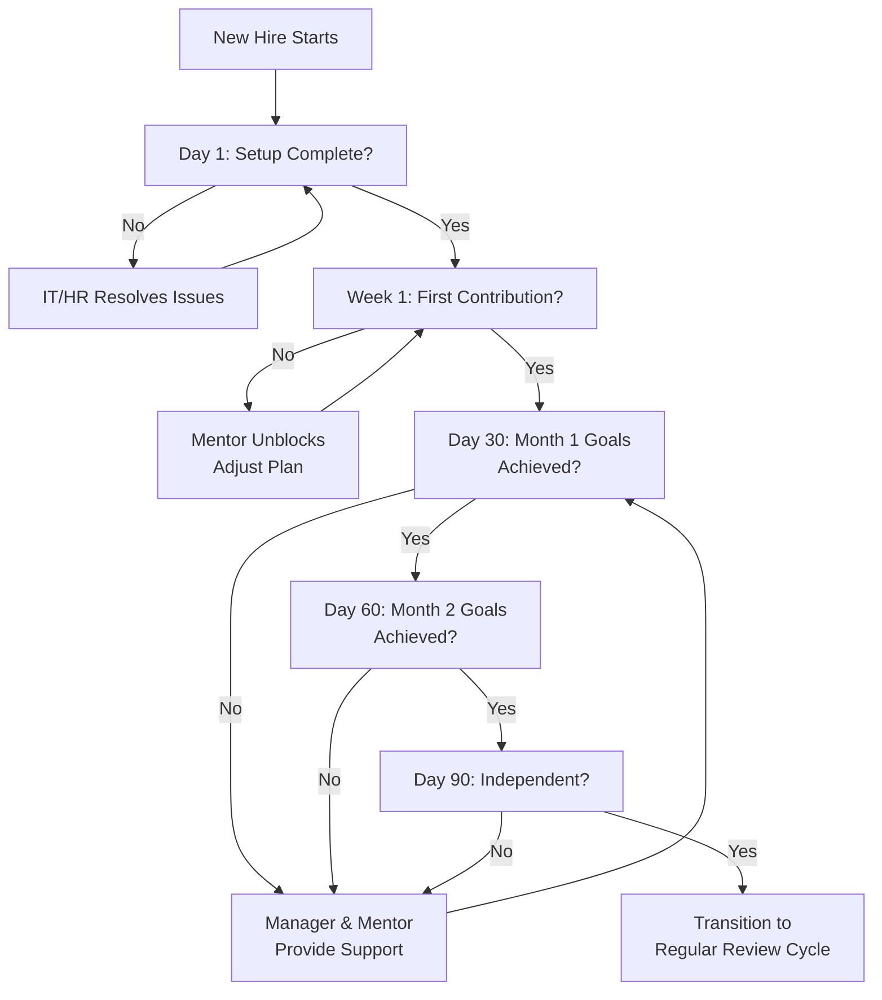

# SOP-050: New Employee Onboarding

**Document ID:** VS-PEO-501  
**Version:** 1.0.0 (Fortune-500 Standard)  
**Effective Date:** January 18, 2026  
**Owner:** VP of People / Chief People Officer  
**Related Documents:** `SOP-030` (Access Control), `VS-GOV-001` (Governance), `../founding-principles/ENGINEERING/REPO_CONVENTIONS.md`
**Last Reviewed:** January 18, 2026

---

## I. PURPOSE & SCOPE

This SOP defines the procedure for onboarding new employees at Vantus Systems. **Effective onboarding** ensures that new team members quickly become productive, understand our culture and values, and have all the tools and knowledge they need to succeed.

**Scope:** Every new hire, full-time employee or contractor, regardless of role or seniority.

---

## II. KEY PRINCIPLES

### Principle: Empirical Veracity

- Onboarding outcomes are measured (time to first contribution, productivity ramp, satisfaction survey).
- New hires are not "done" onboarding until they demonstrate competency in their role.

### Principle: Owner-Operability

- New employees should be able to contribute independently within their first month.
- Knowledge is documented, not tribal.

### Principle: Permanent Traceability

- All onboarding steps are logged (for compliance and to identify gaps in our process).
- New hires receive documented orientation to ensure consistency.

### Principle: Responsible Stewardship

- Onboarding is the company's responsibility, not the new hire's.
- We invest time upfront to avoid costly mistakes later.

---

## III. ROLES & RESPONSIBILITIES

| Role                   | Responsibility                                                                    |
| ---------------------- | --------------------------------------------------------------------------------- |
| **VP of People**       | Owns the onboarding program; reviews metrics.                                     |
| **HR / People Team**   | Administers onboarding; ensures checklists are completed.                         |
| **New Hire's Manager** | Owns the new hire's experience; assigns mentor; confirms readiness.               |
| **Mentor**             | Provides day-to-day guidance; answers questions; ensures new hire gets unblocked. |
| **IT / Ops**           | Provisions hardware, accounts, and access (per SOP-030).                          |
| **New Hire**           | Completes onboarding activities; asks questions; provides feedback.               |

---

## IV. STEP-BY-STEP PROCEDURE

### **Phase 1: Pre-Arrival (2 Weeks Before Start Date)**

#### Step 1.1: Welcome Package Preparation

- [ ] HR prepares a **Welcome Package** to send before the new hire's start date:

**Contents:**

1. Welcome letter from CEO/Founder (personalized if possible).
2. **Vantus Company Handbook** including:
   - Mission, vision, and values.
   - Organizational structure and team overview.
   - Key policies (vacation, health insurance, equipment, work hours, remote work).
   - Code of conduct and anti-harassment policy.
   - Expense policy and reimbursement process.
3. **Onboarding Checklist** (what to expect during first week).
4. **Meet Your Mentor** email with mentor's name, photo, contact info.
5. **Equipment Information** (laptop will be ready on Day 1).
6. **Parking/Office Access** information (if applicable).
7. **First Day Logistics** (arrival time, parking, where to go, who to ask for).

#### Step 1.2: Assign Mentor

- [ ] Manager assigns a **Mentor** (someone in the new hire's department or a peer):
  - Mentor should be 1–2 levels more senior than the new hire.
  - Mentor should be respected and have good communication skills.
  - Mentor receives **mentor guidelines** (see Section VI).

#### Step 1.3: Prepare Workspace & Equipment

- [ ] IT/Ops prepares:
  - [ ] Hardware (laptop, monitor, keyboard, mouse).
  - [ ] Phone (if applicable).
  - [ ] Accounts (email, GitHub, Slack, project management tools, Vault access).
  - [ ] Workspace (desk, chair, any special setup).
  - [ ] Equipment is fully configured and tested before arrival.

#### Step 1.4: Create 30-60-90 Plan

- [ ] Manager creates a **30-60-90 Plan** (sample below):

```markdown
# 30-60-90 Day Plan: [New Hire Name]

**Role:** [Title]  
**Department:** [Department]  
**Manager:** [Manager Name]  
**Start Date:** [Date]

## Month 1 (Days 1–30): Orientation & Foundations

**Goal:** Understand the company, the team, and the codebase.

- [ ] Complete company onboarding (culture, policies, systems).
- [ ] Understand the product (demo, walkthrough of key features).
- [ ] Understand the codebase (guided tour, architecture overview).
- [ ] Set up dev environment (clone repos, install dependencies, run tests).
- [ ] Attend team meetings and meet key people.
- [ ] Complete training modules (security, code standards, our stack).
- [ ] First small contribution (bug fix, documentation, small feature).

**Success Criteria:** New hire can describe the product, navigate the codebase, and understand team processes.

## Month 2 (Days 31–60): Ramp-Up & First Projects

**Goal:** Become productive; contribute to team projects.

- [ ] Complete first feature or project (with mentor support).
- [ ] Participate in code reviews (review others' code, get feedback on yours).
- [ ] Lead one small project or task.
- [ ] Demonstrate understanding of team's technical standards.
- [ ] Proactively ask questions and learn from mistakes.

**Success Criteria:** New hire is completing tasks with minimal supervision; code quality is good; asks good questions.

## Month 3 (Days 61–90): Independence & Ownership

**Goal:** Be fully independent; take ownership of projects.

- [ ] Lead a medium-sized project (with manager oversight).
- [ ] Be on the on-call rotation (if applicable to role).
- [ ] Mentor another team member (reinforce learning).
- [ ] Identify and propose process improvements.
- [ ] Contribute to documentation or internal projects.

**Success Criteria:** New hire is independent; producing high-quality work; contributing to team culture.

## Check-Ins

- **Day 1:** Welcome and setup complete?
- **Day 5:** Are you unblocked and starting to contribute?
- **Day 30:** Month 1 goals achieved? On track for Month 2?
- **Day 60:** Month 2 goals achieved? Ready for independent work?
- **Day 90:** Ready for performance review and regular feedback cycle?
```

---

### **Phase 2: First Day (Day 1)**

#### Step 2.1: Arrival & Welcome

- [ ] **Manager or Mentor meets the new hire:**
  - [ ] Welcome them warmly.
  - [ ] Show them to their workspace.
  - [ ] Confirm equipment is present and working.
  - [ ] Give them a tour of the office (or virtual tour if remote).

#### Step 2.2: Critical Accounts & Access

- [ ] **New hire (with IT support) sets up:**
  - [ ] Email (send welcome message to team).
  - [ ] Slack account (join #general, #welcome, department channel).
  - [ ] GitHub / Git access (clone the main repo).
  - [ ] Project management tool (Jira, Asana, etc.).
  - [ ] Password manager (for secure credential storage).
  - [ ] VPN (if applicable).

#### Step 2.3: Company Orientation (2 Hours)

- [ ] **HR or VP of People conducts orientation:**
  1. **Welcome (10 min):** Overview of the day and coming weeks.
  2. **Mission & Values (15 min):** Review the founding principles and core values; explain why they matter.
  3. **Organizational Structure (15 min):** Who's who; how the company is organized.
  4. **Key Policies (20 min):** Vacation, health insurance, expense reimbursement, code of conduct.
  5. **Benefits & Administrative (20 min):** 401k, insurance, paperwork.
  6. **Q&A (20 min):** Answer any questions.

#### Step 2.4: Department Orientation (2 Hours)

- [ ] **Manager conducts department orientation:**
  1. **Team Overview (15 min):** Meet the team; understand their roles.
  2. **Project Overview (30 min):** What are we building? Current status? How does new hire fit in?
  3. **Team Processes (30 min):** Standups, meetings, code review process, deployment process.
  4. **Dev Environment (45 min):** IT helps new hire clone repos, install dependencies, run tests.

#### Step 2.5: Lunch & Social

- [ ] **Team takes new hire to lunch:**
  - Manager or mentor takes new hire out or coordinates team lunch.
  - Informal time to get to know each other.

#### Step 2.6: Day 1 Wrap-Up

- [ ] **Mentor checks in at end of day:**
  - "How was your first day?"
  - "Do you have everything you need?"
  - "Any blockers or questions?"
  - "Let's plan what you'll work on tomorrow."

#### Step 2.7: Day 1 Checklist Completion

- [ ] **HR logs completion:**
  - [ ] Welcome package received.
  - [ ] All accounts created.
  - [ ] Equipment working.
  - [ ] Company orientation completed.
  - [ ] Dev environment set up.
  - [ ] Mentor assigned and introduced.

---

### **Phase 3: First Week (Days 2–5)**

#### Step 3.1: Code & System Mastery

- [ ] **New hire gets hands-on with the codebase:**
  - [ ] Mentor does a **guided tour** of the code (architecture, key files, entry points).
  - [ ] New hire reads documentation (README, architecture docs, ADRs).
  - [ ] New hire runs the app locally (frontend and backend).
  - [ ] New hire explores the deployment pipeline.

#### Step 3.2: Training Modules

- [ ] **New hire completes training (self-paced or instructor-led):**
  - [ ] **Security Training:** How we handle secrets, access control, compliance.
  - [ ] **Code Standards:** Linting, testing, code review process.
  - [ ] **Tech Stack Deep-Dive:** Languages, frameworks, libraries we use.
  - [ ] **Company Tools:** GitHub, Slack, project management tool, Vault.
  - [ ] **Your Role:** Specific training for the new hire's department (frontend, backend, DevOps, etc.).

#### Step 3.3: Attend Key Meetings

- [ ] New hire attends:
  - [ ] Team standup (understand daily rhythm).
  - [ ] Architecture meeting or tech talk (understand how decisions are made).
  - [ ] All-hands meeting (meet the whole company).
  - [ ] Department meeting (understand priorities).

#### Step 3.4: First Contribution

- [ ] **Manager assigns a small task:**
  - Good options: Bug fix, documentation, small feature, refactor.
  - Mentor helps but new hire does the work.
  - Goal: Gain confidence and learn the dev process (branch, commit, PR, code review, merge, deploy).

#### Step 3.5: Day 5 Check-In

- [ ] **Manager meets with new hire:**
  - "How is the first week going?"
  - "Do you have everything you need?"
  - "Any blockers or concerns?"
  - "Are you comfortable with the codebase?"
  - Review 30-60-90 plan and adjust if needed.

---

### **Phase 4: First Month (Weeks 2–4)**

#### Step 4.1: Ramp-Up Work

- [ ] New hire completes:
  - [ ] Small features (with mentor review).
  - [ ] Participate in code reviews (both giving and receiving feedback).
  - [ ] Pair programming sessions with mentor or peers.
  - [ ] Deeper learning of team's architecture and tech decisions.

#### Step 4.2: Regular 1-on-1s

- [ ] **Manager meets with new hire weekly (1 hour):**
  - "How are you progressing against the 30-60-90 plan?"
  - "What have you learned?"
  - "What's unclear?"
  - "How is the team treating you?"
  - Provide feedback on work quality.

#### Step 4.3: Feedback Loops

- [ ] **Mentor provides informal feedback:**
  - Celebrate wins: "Great code review feedback on Sarah's PR."
  - Constructive feedback: "Next time, ask before merging to main branch."
  - Coaching: "Here's a better way to approach this problem."

#### Step 4.4: Day 30 Assessment

- [ ] **Manager meets with new hire for formal check-in:**

```markdown
# 30-Day Onboarding Assessment: [New Hire Name]

**Date:** [Date]  
**Manager:** [Manager Name]

## Month 1 Goals (From 30-60-90 Plan)

- [ ] Understand company, team, codebase? **[Yes/No/Partial]**
- [ ] Set up dev environment successfully? **[Yes/No]**
- [ ] Make first contribution to codebase? **[Yes/No]**
- [ ] Understand team processes and culture? **[Yes/No/Partial]**

## Work Quality

- [ ] Code quality is meeting team standards? **[Yes/Needs Improvement]**
- [ ] Communication and questions are good? **[Yes/Needs Improvement]**
- [ ] Attitude and engagement are strong? **[Yes/Needs Improvement]**

## Onboarding Experience (Feedback from New Hire)

- [ ] Onboarding was well-organized? **[Yes/Partial/No]**
- [ ] You felt welcomed and supported? **[Yes/Partial/No]**
- [ ] Mentor was helpful? **[Yes/Partial/No]**
- [ ] Any specific improvements to our onboarding process?

## Next Month Goals

[Adjust 30-60-90 plan based on progress]

## Sign-Off

**New Hire:** I understand the expectations for Month 2 and feel ready to progress.  
Signature: **\*\*\*\***\_**\*\*\*\*** Date: \***\*\_\*\***

**Manager:** I confirm the new hire is on track or identify specific areas for improvement.  
Signature: **\*\*\*\***\_**\*\*\*\*** Date: \***\*\_\*\***
```

#### Step 4.5: Continue Through Days 60 & 90

- [ ] Repeat the check-in process at Days 60 and 90.
- [ ] Ensure new hire is hitting milestones (independence, ownership, quality).
- [ ] By Day 90, new hire should be fully productive and independent.

---

### **Phase 5: Beyond 90 Days**

#### Step 5.1: Transition to Regular Review Cycle

- [ ] After Day 90, transition to **regular 1-on-1s and performance reviews**:
  - Quarterly check-ins on goals and development.
  - Annual performance review (see SOP-051).

#### Step 5.2: Gather Onboarding Feedback

- [ ] **VP of People surveys new hires at Day 90:**

```markdown
# Onboarding Experience Survey

**New Hire:** [Name]  
**Hire Date:** [Date]  
**Manager:** [Manager Name]

Please rate your onboarding experience (1=Poor, 5=Excellent):

- [ ] Company orientation was clear and helpful? (1–5)
- [ ] Mentor was supportive and helpful? (1–5)
- [ ] You felt welcomed by the team? (1–5)
- [ ] You understood the product and codebase quickly? (1–5)
- [ ] You had the tools and resources to succeed? (1–5)
- [ ] You felt productive and contributing by Day 30? (1–5)
- [ ] By Day 90, you felt fully independent? (1–5)

**Overall onboarding experience:** (1–5)

**What could we improve about our onboarding?**
[Open-ended feedback]

**Would you recommend Vantus Systems as a great place to work?** (Yes/No)
```

#### Step 5.3: Continuous Improvement

- [ ] **VP of People reviews feedback quarterly:**
  - Identify patterns (e.g., "All new hires mention the codebase was hard to navigate").
  - Update onboarding process based on feedback.
  - Share improvements with the team.

---

## V. DECISION TREE: Onboarding Readiness



---

## VI. TEMPLATES & CHECKLISTS

### Welcome Package Contents

- [ ] Welcome letter (CEO).
- [ ] Company handbook.
- [ ] Onboarding checklist.
- [ ] Meet your mentor (with photo/bio).
- [ ] Equipment details.
- [ ] First day logistics.
- [ ] Org chart.
- [ ] Key contacts and extensions.

### Day 1 Checklist

- [ ] Hardware (laptop, monitor, keyboard, mouse) set up and tested.
- [ ] Email account created and working.
- [ ] Slack account created; joined #general, #welcome, department channels.
- [ ] GitHub access configured.
- [ ] Project management tool access.
- [ ] VPN (if applicable).
- [ ] Password manager set up.
- [ ] Company orientation completed.
- [ ] Department orientation completed.
- [ ] Mentor introduced and contact info shared.
- [ ] First day lunch completed.
- [ ] End-of-day check-in with mentor completed.

### Mentor Guidelines

```markdown
# Mentor Guidelines: [New Hire Name]

**Your Role:** Help [New Hire] become productive and feel welcome at Vantus.

**Your Responsibilities:**

1. Be available (check in daily, at least in first week).
2. Answer questions (no question is dumb).
3. Pair program on first tasks.
4. Provide feedback (celebrate wins, coach on mistakes).
5. Escalate blockers (if new hire is stuck, help them unblock).
6. Introduce to people (help them build relationships).
7. Explain our culture (why we do things the way we do).

**When to Escalate to Manager:**

- New hire is not understanding core concepts.
- Onboarding is taking longer than expected.
- New hire has concerns about fit or culture.
- New hire is having personal issues affecting work.

**Mentor Check-Ins:**

- [ ] Day 1: "Welcome! Let me show you around."
- [ ] Day 3: "How are things going? Any blockers?"
- [ ] Day 5: "Ready for your first contribution?"
- [ ] Week 2: "How was your first week?"
- [ ] Weekly (Weeks 2–4): Brief check-in, feedback on work.
- [ ] Week 4: "How are you feeling about Month 2?"

**Thank you for mentoring!**
```

### 30-60-90 Plan Template

[See Section IV, Step 1.4]

### Day 30 Assessment Template

[See Section IV, Step 4.4]

---

## VII. ESCALATION PATHS

| Situation                                        | Escalate To              | Timeline          |
| ------------------------------------------------ | ------------------------ | ----------------- |
| New hire feels unwelcome or bullied              | Manager + VP of People   | Immediately       |
| New hire is significantly behind on goals        | Manager + VP of People   | By Day 20         |
| New hire is struggling with code quality         | Manager + Technical Lead | Within first week |
| Onboarding equipment is not ready                | IT Manager + Manager     | Before Day 1      |
| New hire doesn't understand role or expectations | Manager + VP of People   | Within first week |

---

## VIII. SUCCESS CRITERIA

**Onboarding is "Done" when:**

1. ✅ New hire has completed all Day 1 and Week 1 activities.
2. ✅ New hire has made their first contribution (code, documentation, etc.).
3. ✅ New hire understands the product, team, and codebase.
4. ✅ New hire's 30-60-90 goals are on track at Day 30 and Day 60.
5. ✅ New hire is fully independent by Day 90.
6. ✅ New hire has completed onboarding feedback survey.
7. ✅ New hire's manager confirms readiness to transition to regular feedback cycle.

**Audit:** Review onboarding checklist and Day 30/60/90 assessments for completeness.

---

## IX. AUDIT & COMPLIANCE

### Audit Checklist (Quarterly)

- [ ] All new hires completed onboarding checklist.
- [ ] All new hires completed 30-60-90 assessments.
- [ ] All new hires provided feedback survey.
- [ ] Average onboarding satisfaction is 4+/5.
- [ ] New hires reached productivity milestones on schedule.

### Compliance Log

Create an onboarding audit log entry in the domain audit-log location used by the team.

```markdown
# New Hire Onboarding Audit Log

| New Hire | Start Date | Mentor   | Day 30 Status | Day 90 Status | Feedback Score | Notes         |
| -------- | ---------- | -------- | ------------- | ------------- | -------------- | ------------- |
| [Name]   | [Date]     | [Mentor] | On Track      | Independent   | 4.5/5          | [Any issues?] |
```

---

## X. EXAMPLES & CASE STUDIES

### Example 1: Backend Engineer Onboarding (Smooth)

**New Hire:** Alex, Backend Engineer  
**Start Date:** Jan 8, 2026

**Timeline:**

- **Day 1:** Welcome, setup, company orientation. Assigned mentor (Sarah, senior backend engineer).
- **Days 2–5:** Guided code tour, dev environment, first contribution (bugfix).
- **Week 2–3:** Feature work with mentor review; code review participation.
- **Day 30:** Milestone achieved; understanding of codebase good; code quality good.
- **Days 31–60:** Independent feature work; takes ownership of a small system.
- **Day 60:** On track; proposing small improvements.
- **Days 61–90:** Leads a feature; mentors an intern.
- **Day 90:** Fully independent; scheduled for on-call rotation next month.

**Feedback:** "Onboarding was smooth. Mentor was great. I feel ready to contribute."

---

### Example 2: Product Manager Onboarding (Adjusted)

**New Hire:** Jordan, Product Manager  
**Start Date:** Jan 15, 2026

**Timeline:**

- **Day 1:** Welcome, setup. Note: Takes longer to understand the product (no code to learn).
- **Days 2–5:** Product demo, customer calls, feature roadmap review.
- **Week 2–3:** Research current customers; identify gaps.
- **Day 30:** Milestone achieved; understands product and customers; contributed to Q1 roadmap planning.
- **Days 31–60:** Leads feature discovery for new integration feature; owns customer feedback channel.
- **Day 90:** Fully independent; leading product strategy discussions.

**Feedback:** "Great onboarding for PM role. Could have done more customer interviews earlier."

---

## XI. GLOSSARY

| Term                | Definition                                                                         |
| ------------------- | ---------------------------------------------------------------------------------- |
| **Onboarding**      | The process of integrating a new employee into the company and their role.         |
| **Mentor**          | A more senior team member who provides guidance and support to the new hire.       |
| **30-60-90 Plan**   | A structured plan for new hire productivity and milestones over the first 90 days. |
| **Ramp-Up**         | The period when a new hire is becoming productive and learning the role.           |
| **Dev Environment** | Local setup on a developer's computer to run and test code.                        |
| **Blockers**        | Issues or questions preventing the new hire from moving forward.                   |

---

**Document History:**

- **v1.0.0** (Jan 18, 2026) — Initial publication; comprehensive onboarding framework.

**Next Review Date:** July 18, 2026

_End of SOP-050. All new hires must be onboarded using this procedure._
